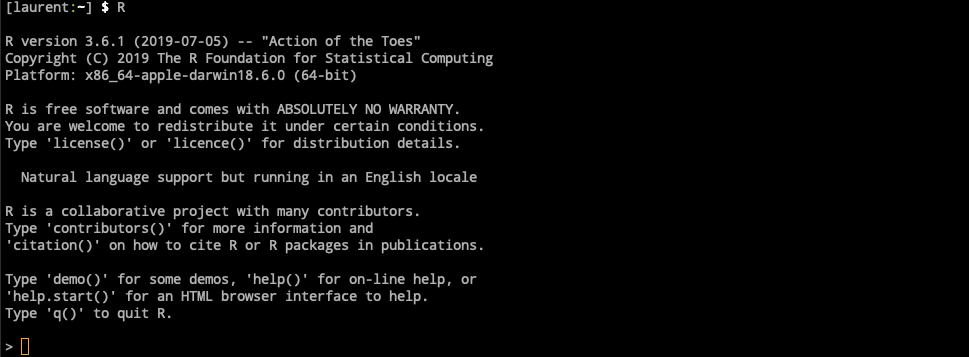

<style type="text/css">
h3 { /* Header 3 */
position: relative ;
color: #729FCF ;
left: 5%;
}
h1 { /* Header 1 */
color: #034b6f ;

} 
#pencadre{
  border:1px; 
  border-style:solid; 
  border-color: #034b6f; 
  background-color: #EEF3F9; 
  padding: 1em;
  text-align: center ;
}
img[toto] { 
width: 200px; 
}
</style>


```{r setup, include=FALSE}
knitr::opts_chunk$set(echo = TRUE)
```


The goal of this practical is to familiarize yourself with R and the RStudio
environment.

The objectives of this session will be to:

- Understand the purpose of each pane in RStudio
- Do basic computation with R
- Define variables and assign data to variables
- Manage a workspace in R
- Call functions
- Manage packages

### Acknowledgments

<div id='pencadre'>

  {width=300px}
  
  
  https://software-carpentry.org/
</div> 

 
<div id='pencadre'>
  {width=100px}
 
  http://swcarpentry.github.io/r-novice-gapminder/
</div> 


# Some R background

{width=40px}
is a programming language and free software environment for statistical
computing and graphics supported by the *R Foundation for Statistical Computing*.

- Created by **Ross Ihaka** and **Robert Gentleman**
- initial version released in 1995
- free and open-source implementation the S programming language
- currently developed by the **R Development Core Team**.


Reasons to use it:

- It’s free, well documented, and runs almost everywhere
- it has a large (and growing) user base among scientists
- it has a large library of external packages available for performing diverse tasks. 

- **15,068** available packages on https://cran.r-project.org/
- **3,087** available packages on http://www.bioconductor.org
- **122,720** available repository on https://github.com/




# RStudio, the R Integrated development environment (IDE)

IDR application that provides **comprehensive facilities** to computer programmers for
software development


- free
- open source

### An interface


### The same console as before


# R as a calculator

- Add: `+`
- Divide: `/`
- Multiply: `*`
- Subtract: `-`
- Exponents: `^` or `**`
- Parentheses: `(`, `)`

<div id='pencadre'>
**Write the commands in the grey box in the terminal.**

**The expected results will always be printed in a white box here.**

**You can "copy-paste" but I advise you to practice writing directly in the terminal. To validate the line at the end of your command: press 'Enter'.**
</div> 


### First commands

```{r calculatorstep1, include=TRUE}
1 + 100
```

 \ 
```R
1 +
```
The console displays '+'.  
It is waiting for the next command. Write juste '100' :

```R
100
```
```{r calculatorstep2, echo=FALSE}
1 + 100
```


### R keeps to the mathematical order
```{r calculatorstep3, include=TRUE}
3 + 5 * 2
```

```{r calculatorstep4, include=TRUE}
(3 + 5) * 2
```

 \ 

```{r calculatorstep5, include=TRUE}
(3 + (5 * (2 ^ 2))) # hard to read
3 + 5 * 2 ^ 2       # clear, if you remember the rules
3 + 5 * (2 ^ 2)     # if you forget some rules, this might help
```
 \ 
 **Note :** The text following a '#' is a comment. It will not be interpreted by R. In the future, I advise you to use comments a lot to explain in your own words what the command means. 

### Scientific notation
```{r calculatorstep6, include=TRUE}
2/10000
```

\pause

`2e-4` is shorthand for `2 * 10^(-4)`

```{r calculatorstep7, include=TRUE}
5e3
```

### Mathematical functions

```{r calculatorstep8, include=TRUE}
log(1)  # natural logarithm
```

```{r calculatorstep9, include=TRUE}
log10(10) # base-10 logarithm
```

```{r calculatorstep10, include=TRUE}
exp(0.5)
```

\ 

Compute the factorial of `9` (9!)

```{r calculatorstep11, include=TRUE}
9 * 8 * 7 * 6 * 5 * 4 * 3 * 2 * 1
```

 \ 
**or**
```{r calculatorstep12, include=TRUE}
factorial(9)
```

### Comparing things

Comparisons can be made with R. The result will return a TRUE or FALSE value.


equality (note two equal signs read as "is equal to")
```{r calculatorstep13, include=TRUE}
1 == 1
```


inequality (read as "is not equal to")
```{r calculatorstep14, include=TRUE}
1 != 2 
```


less than
```{r calculatorstep15, include=TRUE}
1 < 2
```


less than or equal to
```{r calculatorstep16, include=TRUE}
1 <= 1
```


greater than
```{r calculatorstep17, include=TRUE}
1 > 0
```

# Variables and assignment

`<-` is the assignment operator in R. (read as left member take right member value)

```R
x <- 1/40
```

```R
x
```

## The environment

\includegraphics[width=\textwidth]{img/RStudio_environment.png}

### Variables and assignment

```R
log(x)
x <- 100
log(x)
```
\pause

```R
x <- x + 1
y <- x * 2
```

\pause

```R
z <- "x"
x + z
```

## Variables and assignment

Variable names can contain letters, numbers, underscores and periods.

They cannot start with a number nor contain spaces at all.

Different people use different conventions for long variable names, these include

```R
periods.between.words
underscores_between_words
camelCaseToSeparateWords
```

What you use is up to you, but be consistent.

\pause
It is also possible to use the `=` operator for assignment but **don’t do it !**

## Variables and assignment

Which of the following are valid R variable names?

```
min_height
max.height
_age
.mass
MaxLength
min-length
2widths
celsius2kelvin
```

**http://perso.ens-lyon.fr/laurent.modolo/R/1_a**

## Functions are also variables

```R
logarithm <- log
```

\pause

A R function can have different arguments

```R
function (x, base = exp(1))
```

- `base` is a named argument  are read from left to right
- named arguments breaks the reading order
- named arguments make your code more readable

\pause

To know more about the `log` function we can read its manual.

```R
help(log)
```

\pause

```R
?log
```

## Various output

\includegraphics[width=\textwidth]{img/RStudio_outputs.png}

## Functions are also variables

Test that your `logarithm` function can work in base 10

\pause

```R
10^logarithm(12, base = 10)
```

## Functions are also variables

We can also define our own function with
```R
function_name <- function(a, b){
  result_1 <- operation1(a, b)
  result_2 <- operation2(result_1, b)
  return(result_2)
}
```

\pause

write a function to test the base of the logarithm function

\pause

```R
base_test <- function(x, base){
  log_result <- logarithm(x, base=base)
  exp_result <- base^log_result
  test_result <- x == exp_result
  return(test_result)
}
```

**http://perso.ens-lyon.fr/laurent.modolo/R/1_b**

## Functions are also variables

```R
base_test <- function(x, base){
  print(x)
  log_result <- logarithm(x, base=base)
  print(log_result)
  exp_result <- base^log_result
  print(exp_result)
  print(x)
  test_result <- x == exp_result
  return(test_result)
}
```

**http://perso.ens-lyon.fr/laurent.modolo/R/1_c**

## Functions are also variables

```R
base_test <- function(x, base){
  print(x)
  log_result <- logarithm(x, base=base)
  print(log_result)
  exp_result <- base^log_result
  print(exp_result)
  print(x)
  test_result <- isTRUE(all.equal(x, exp_result))
  return(test_result)
}
```

**http://perso.ens-lyon.fr/laurent.modolo/R/1_d**

## Functions are also variables

```R
base_test <- function(x, base){
  return(isTRUE(all.equal(x, base^logarithm(x, base=base))))
}
```

**http://perso.ens-lyon.fr/laurent.modolo/R/1_e**

## The environment

\includegraphics[width=\textwidth]{img/RStudio_environment.png}

## A code editor

\includegraphics[width=\textwidth]{img/RStudio_editor.png}

## A code editor

RStudio offers you great flexibility in running code from within the editor window. There are buttons, menu choices, and keyboard shortcuts. To run the current line, you can

- click on the Run button above the editor panel, or
- select “Run Lines” from the “Code” menu, or
- hit Ctrl+Return in Windows or Linux or Cmd+Return on OS X. To run a block of code, select it and then Run. 

If you have modified a line of code within a block of code you have just run, there is no need to reselect the section and Run, you can use the next button along, Rerun the previous region. This will run the previous code block including the modifications you have made.

## A code editor

Copy your `logarithm` and `base_test` into a `tp_1.R` file

\pause

We can now clean your environment

```R
rm(x)
```

\pause

```R
?rm
```

\pause

```R
ls()
```

\pause

```R
rm(list = ls())
```

## Installing packages

```R
install.packages("tidyverse")
```

```R
install.packages("ggplot2")
```

## Installing packages

\includegraphics[width=\textwidth]{img/RStudio_outputs.png}

## Loading packages

```R
sessionInfo()
```

\pause

```R
library(tidyverse)
```

\pause

```R
sessionInfo()
```

\pause

```R
unloadNamespace("tidyverse")
```

\pause

```R
sessionInfo()
```

# Complex variable type

## Vector (aka list)

```R
c(1, 2, 3, 4, 5)
```

\pause

```R
1:5
```

\pause

```R
2^(1:5)
```

\pause

```R
x <- 1:5
2^x
```

\pause

```R
log(x)
logarithm(x)
base_test(x, base = 10)
```

## Vector (aka list)

```R
typeof(x)
```

\pause

```R
typeof(x + 0.5)
```

\pause

```R
is.vector(x)
```

\pause

```R
y <- c(a = 1, b = 2, c = 3, d = 4, e = 5)
typeof(y)
is.vector(y)
```

\pause

```R
x == y
```

\pause

```R
all.equal(x, y)
```


