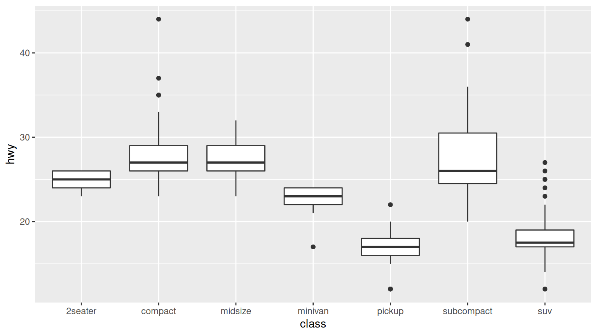
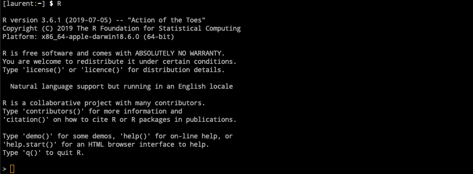
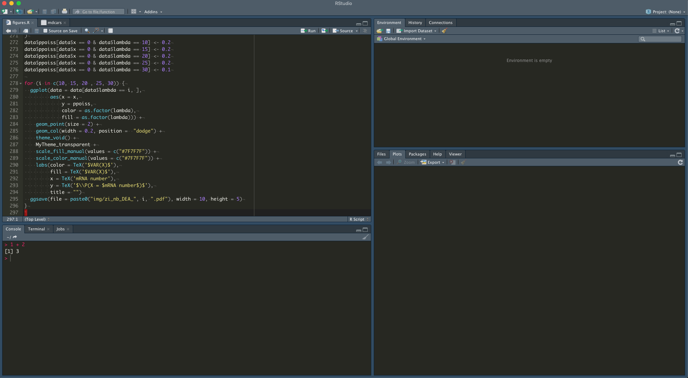
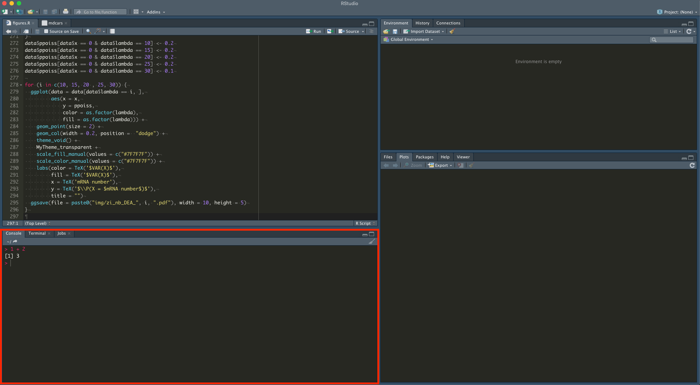
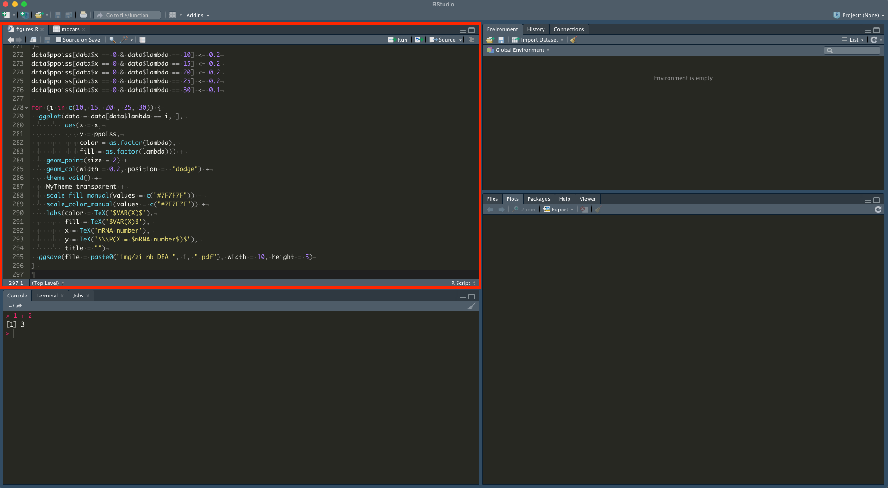
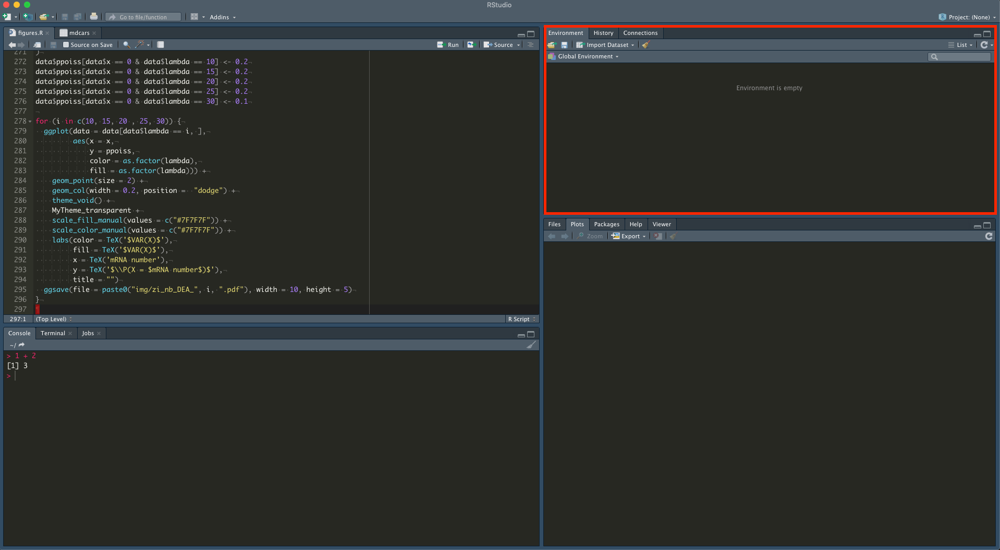
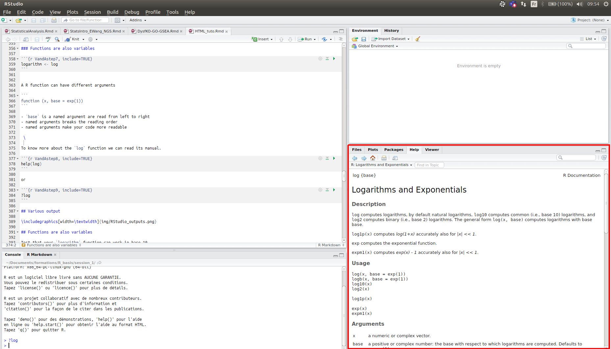
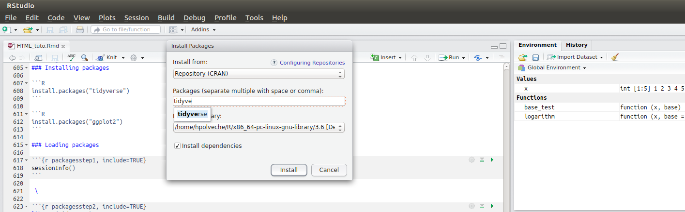

```{r include=FALSE}
library(fontawesome)
```

```{r setup, include=FALSE , echo=FALSE}
rm(list=ls())
knitr::opts_chunk$set(echo = TRUE)
knitr::opts_chunk$set(comment = NA)
```


## Introduction

The goal of this practical is to familiarize yourself with R and the RStudio
environment.

The objectives of this session will be to:

- Understand the purpose of each pane in RStudio
- Do basic computation with R
- Define variables and assign data to variables
- Manage a workspace in R
- Call functions
- Manage packages
- Be ready to write graphics !

<center>
{width=400px}
</center>

### Acknowledgments

{width=300px}

{width=300px}{width=300px}

- [software-carpentry.org](https://software-carpentry.org/)
- [moderndive.com](https://moderndive.com)
- [swcarpentry.github.io](http://swcarpentry.github.io/r-novice-gapminder/)

### Some R background

{width=40px}
is a programming language and free software environment for statistical
computing and graphics supported by the *R Foundation for Statistical Computing*.

- Created by **Ross Ihaka** and **Robert Gentleman**
- initial version released in 1995
- free and open-source implementation the S programming language
- Currently developed by the **R Development Core Team**.


Reasons to use it:

- It's open source, which means that we have access to every bit of underlying computer code to prove that our results are correct (which is always a good point in science).
- It's free, well documented, and runs almost everywhere
- It has a large (and growing) user base among scientists
- It has a large library of external packages available for performing diverse tasks.

```{r echo=F, message=F}
cran_packages <- nrow(available.packages(repos = "http://cran.us.r-project.org"))

if (! require("rvest")) {
  install.packages("rvest", quiet = T)
}

library(rvest)
url <- 'https://www.bioconductor.org/packages/release/bioc/'
biocPackages <- url %>% read_html() %>% html_table() %>%.[[1]]
bioconductor_packages <- nrow(biocPackages)
```

- **`r cran_packages`** available packages on https://cran.r-project.org/
- **`r bioconductor_packages`** available packages on http://www.bioconductor.org
- **>500k** available repository using R on https://github.com/

### How do I use R ?

Unlike other statistical software programs like Excel, SPSS, or Minitab that provide [point-and-click](https://en.wikipedia.org/wiki/Point_and_click) interfaces, R is an [interpreted language](https://en.wikipedia.org/wiki/Interpreted_language).

This means that you have to write instructions for R. Which means that you are going to learn to write code / program in R.

R is generally used in a terminal in which you can type or paste your R code:



But navigating between your terminal, your code and your plots can be tedious, this is why in `r format(Sys.time(), "%Y")` there is a better way to use R !

### RStudio, the R Integrated development environment (*IDE*)

An IDE application provides **comprehensive facilities** to computer programmers for
software development. RStudio is **free** and **open-source**.

To open RStudio, you can install the [RStudio application](https://www.rstudio.com/products/rstudio/) and open the app.

Otherwise you can use the link and the login details provided to you by email. The web version of RStudio is the same as the application except that you can open it in any recent browser.

#### RStudio interface



#### A R console

The same console as before (in Red box)




#### A code editor

We are now going to write our first commands.
We could do it directly in the R console, with multi-line commands but this process is tedious.

Instead we are going to use the RStudio code editor panel, to write our code.
You can go to **File > New File > R script** to open your editor panel.

Beside, you can keep your code history.




### How to execute R code in RStudio ?

RStudio gives you great flexibility in running code from the editor window. There are buttons, menu choices, and keyboard shortcuts. To run the current line, you can:

- click on the `Run` button above the editor panel, or
- select `Run Selected Lines` from the `Code` menu, or
- hit `Ctrl`+`Return` in Windows or Linux or `Cmd`+`Return` on OS X. To run a block of code, select it and then click on `Run`.

If you have modified a line of code within a block of code you have just run, there is no need to re-select the section and press `Run`. Instead, you can use the next button `Re-run the previous code region`. This will run the previous code block including the modifications you have made.


## R as a Calculator

Now that we know what we should do and what to expect, we are going to try some basic R instructions. A computer can perform all the operations that a calculator can do, so let's start with that:

- Add: `+`
- Divide: `/`
- Multiply: `*`
- Subtract: `-`
- Exponents: `^` or `**`
- Parentheses: `(`, `)`

<div class="pencadre"> <!-- TODO: replace with quarto callout -->
Now Open RStudio.

You can `copy paste` but I advise you to practice writing directly in the terminal.
Like all the languages, you will become more familiar with R by using it.

To validate the line at the end of your command: press `Return`.
</div>


### First commands

You should see a `>` character before a blinking cursor. The `>` is called a prompt. The prompt is shown when you can enter a new line of R code.
```{r calculatorstep1, include=T, eval=F}
1 + 100
```

For classical output, R will write the results with a `[N]` with `N` the row number.
Here you have a one-line results `[1]`

```{r calculatorstep1res, echo=F, eval=T}
1 + 100
```

Do the same things but press `⏎` (return) after typing `+`.

```R
1 +
```

The console displays `+`.
The `>` can become a `+` in case of multi-lines code.
As there are two sides to the `+` operator, R know that you still need to enter the right side of your formula.
It is waiting for the next command. Write just `100` and press `⏎`:

```R
100
```

```{r calculatorstep2, echo=FALSE}
1 + 100
```

### Errors, warnings, and messages

The R console is a textual interface, which means that you will enter code, but it also means that R is going to write information back to you and that you will have to pay attention at what is written.

There are 3 categories of messages that R can send you: **Errors** prefaced with `Error in…`, **Warnings** prefaced with `Warning:` and **Messages** which don't start with either `Error` or `Warning`.

- **Errors**, you must consider them as red light. You must figure out what is causing it. Usually you can find useful clues in the errors message about how to solve it.
- **Warning**, warnings are yellow light. The code is running but you have to pay attention. It's almost always a good idea to try to fix warnings.
- **Message** are just friendly messages from R telling you how things are running.


### R keeps to the mathematical order

The order of operation is the natural mathematical order in R:

```{r calculatorstep3, include=TRUE}
3 + 5 * 2
```

You can use parenthesis `(` `)` to change this order.

```{r calculatorstep4, include=TRUE}
(3 + 5) * 2
```

But too much parenthesis can be hard to read

```{r calculatorstep5, include=TRUE}
(3 + (5 * (2 ^ 2))) # hard to read
3 + 5 * (2 ^ 2)     # if you forget some rules, this might help
```

**Note :** The text following a `#` is a comment. It will not be interpreted by R. In the future, I advise you to use comments a lot to explain in your own words what the command means.

### Scientific notation

For small of large numbers, R will automatically switch to scientific notation.

```{r calculatorstep6, include=TRUE}
2/10000
```

`2e-4` is shorthand for `2 * 10^(-4)`
You can use `e` to write your own scientific notation.

```{r calculatorstep7, include=TRUE}
5e3
```

### Mathematical functions

R is distributed with a large number of existing functions.
To call a mathematical function, you must use `function_name(<number>)`.

For example, for the natural logarithm:

```{r calculatorstep8, include=TRUE}
log(2)  # natural logarithm
```

```{r calculatorstep9, include=TRUE}
log10(10) # base-10 logarithm
```

```{r calculatorstep10, include=TRUE}
exp(0.5)
```

Compute the factorial of 9 (`9!`)

```{r calculatorstep11, include=TRUE}
9 * 8 * 7 * 6 * 5 * 4 * 3 * 2 * 1
```

or

```{r calculatorstep12, include=TRUE}
factorial(9)
```

### Comparing things

We have seen some examples that R can do all the things that a calculator can do.
But when we are speaking of programming language, we are thinking of writing [computer programs](https://en.wikipedia.org/wiki/Computer_program).
Programs are collections of instructions that perform specific tasks.
If we want our future programs to be able to perform automatic choices, we need them to be able to perform comparisons.

Comparisons can be made with R. The result will return a `TRUE` or `FALSE` value (which is not a number as before but a `boolean` type).

<div class="pencadre"> <!-- TODO: replace with quarto callout -->
Try the following operator to get a `TRUE` then change your command to get a `FALSE`.

You can use the `↑` (upper arrow) key to edit the last command and go through your history of commands
</div>

- equality (note: two equal signs read as "is equal to")

```{r calculatorstep13, include=TRUE}
1 == 1
```

- inequality (read as "is not equal to")
```{r calculatorstep14, include=TRUE}
1 != 2
```

- less than
```{r calculatorstep15, include=TRUE}
1 < 2
```

- less than or equal to
```{r calculatorstep16, include=TRUE}
1 <= 1
```

- greater than
```{r calculatorstep17, include=TRUE}
1 > 0
```

<div class="pencadre"> <!-- TODO: replace with quarto callout -->
  **Summary so far**

  - R is a programming language and free software environment for statistical
computing and graphics (free & opensource) with a large library of external packages available for performing diverse tasks.
  - RStudio is an IDE application that provides comprehensive facilities to computer programmers for software development.
  - R can be used as a calculator
  - R can perform comparisons

</div>

## Variables and assignment

In addition to being able to perform a huge number of computations very fast, computers can also store information in memory.
This is a mandatory function to load your data and store intermediate states in your analysis.

In R `<-` is the assignment operator (read as left member take right member value).

`=` Also exists but is **not recommended!** It will be used preferentially in other cases. (*We will see them later*).
If you really don't want to press two consecutive keys for assignment, you can press `alt` + `-` to write `<-`.
RStudio provides lots of such shortcuts (you can display them by pressing `alt` + `shift` + `k`).

We assign a value to `x`, `x` is called a variable.

```{r VandAstep1, include=TRUE}
x <- 1 / 40

```

We can then ask R to display the value of `x`.
```{r VandAstep2, include=TRUE}
x
```

### The environment

You now see the `x` value in the environment box (*in red*).



This **variable** is present in your work environment. You can use it to perform different mathematical applications.


```{r VandAstep3, include=TRUE}
log(x)
```

You can assign another value to `x`.
```{r VandAstep4, include=TRUE}
x <- 100
log(x)
```

```{r VandAstep5, include=TRUE}
x <- x + 1  # x become 101 (100 + 1)
y <- x * 2
y
```

A variable can be assigned a `numeric` value as well as a `character` value.

Just put the character (or string) between double quote `"` when you assign this value.
```{r VandAstep6, include=TRUE}
z <- "x"  # One character
z
a <- "Hello world"  # Multiple characters == String
a
```

You cannot mix different types of variable together:

```R
x + z
```

How to test the type of the variable?
```{r VandAstep20, include=TRUE}
is.character(z)
b <- 1 / 40
b
typeof(b)
```

You can type `is.` and press the `tabulation` key (`↹`).
RStudio will show you a list of function whose names start with `is.`.
This is called autocompletion, don't hesitate to spam your `tabulation` key as you write R code.

### Variables names

Variable names can contain **letters**, **numbers**, **underscores** and **periods**.

They **cannot start with a number or an underscore** nor contain spaces at all.

Different people use different conventions for long variable names, these include:

```r
periods.between.words
underscores_between_words
camelCaseToSeparateWords
```

What you use is up to you, but be consistent.

<div class="pencadre"> <!-- TODO: replace with quarto callout -->  Which of the following are valid R variable names?</div>

```{r eval=F, }
min_height
max.height
_age
.mass
MaxLength
min-length
2widths
celsius2kelvin
```

<details><summary>Solution</summary>
<p>
```{r eval=F, }
min_height
max.height
.mass
MaxLength
celsius2kelvin
```
</p>
</details>

### Functions are also variables

```{r VandAstep7, include=TRUE}
logarithm <- log
```

Try to use the `logarithm` variable.


A R function can have different arguments

```r
function (x, base = exp(1))
```

- `base` is a named argument read from left to right
- named arguments breaks the reading order
- named arguments make your code more readable

To know more about the `log` function we can read its manual.

```{r VandAstep8, include=TRUE, eval=FALSE}
help(log)
```

or

```{r VandAstep9, include=TRUE, eval=FALSE}
?log
```

This block allows you to view the different outputs (?help, graphs, etc.).



<div class="pencadre"> <!-- TODO: replace with quarto callout -->
Test that your `logarithm` function can work in base 10
</div>

<details><summary>Solution</summary>
<p>
```R
10^logarithm(12, base = 10)
```
</p>
</details>


### Writing function

We can define our own function with:

- function name,
- declaration of function type: `function`,
- arguments: between `(` `)`,
- `{` and `}` to open and close function body,

Here is an example of function declaration with two arguments `a` and `b`.  Any argument name can be used.

```R
function_name <- function(a, b){


}
```

- a series of operations,

The argument `a` and `b` are accessible from within the function body as the variable `a` and `b`.
In the function body argument are independent of the global environment.

```R
function_name <- function(a, b){
  result_1 <- operation1(a, b)
  result_2 <- operation2(result_1, b)

}
```

- `return` operation,

At the end of a function we want to return a result, so function calls will be equal to this result.

```R
function_name <- function(a, b){
  result_1 <- operation1(a, b)
  result_2 <- operation2(result_1, b)
  return(result_2)
}
```

**Note: ** if you don't use `return` by default the evaluation of the last line of your function body is returned.

**Note: **  The function variables (here `a` and `b`) are independent of the global environment: They define to which values the operation will be applied in the function body.

-  The order of arguments is important

<div class="pencadre"> <!-- TODO: replace with quarto callout -->
Predict the result of R1, R2 and R3.

```R
minus <- function(a, b){
  result_1 <- a - b
  return(result_1)
}

##R1:
R1 <- minus(4,2)

##R2
R2 <- minus(2,4)

##R3
a <- 2
b <- 10
R3  <-  minus(b,a)
```
</div>

<details><summary>Solution 1</summary>
<p>
```{r minus1, include=TRUE}
minus <- function(a, b){
  result_1 <- a - b
  return(result_1)
}
minus(4,2)
```
</p>
</details>


<details><summary>Solution 2</summary>
<p>
```{r minus2, include=TRUE}
minus(2,4)
```
</p>
</details>


<details><summary>Solution 3</summary>
<p>
```{r minus3, include=TRUE}
a <- 2
b <- 10
minus(b,a)
```
</p>
</details>

- Naming variables is more explicit and bypasses the order.

<div class="pencadre"> <!-- TODO: replace with quarto callout -->
Predict the result of R1, R2, R3 and R4.
```R
a <- 10
b <- 2

minus <- function(a, b){
  result_1 <- a - b
  return(result_1)
}

##R1:
R1 <- minus(a=6,b=3)

##R2
R2 <- minus(b=3,a=6)

##R3
R3 <- a

##R4
R4  <- minus(b=b,a=a)
```
</div>

<details><summary>Solution 1</summary>
<p>
```{r minus21, include=TRUE}
a <- 10
b <- 2
minus <- function(a, b){
  result_1 <- a - b
  return(result_1)
}
R1 <- minus(a=6,b=3)
R1
```
</p>
</details>


<details><summary>Solution 2</summary>
<p>
```{r minus22, include=TRUE}
R2 <- minus(b=3,a=6)
R2
```
</p>
</details>


<details><summary>Solution 3</summary>
<p>
```{r minus23, include=TRUE}
R3 <- a
R3
```
</p>
</details>

<details><summary>Solution 4</summary>
<p>
```{r minus24, include=TRUE}
R4  <- minus(b=b,a=a)
R4
```
</p>
</details>


- Default values for arguments may be set at definition and the default value is used when argument is not provided.

```{r minus10, include=TRUE}
minus_10 <- function(a, b=10){
  result_1 <- a - b
  return(result_1)
}
minus_10(40)
minus_10(40,b=5)
minus_10(40,5)
```
- Functions can be define without argument

```{r print_hw, include=TRUE}
print_hw <- function(){
  print("Hello world!")
  print("How R U?")
}
```

<div class="pencadre"> <!-- TODO: replace with quarto callout -->
What is the difference between `print_hw` and `print_hw()` ?

</div>

<details><summary>Solution</summary>
<p>
`print_hw` is considered as an environment variable, and R returns the definition of `print_hw`.
You need to add `()` to execute it

```{r print_hw_env, include=TRUE}
print_hw
```

```{r print_hw_e, include=TRUE}
print_hw()
```

</p>
</details>


### Some exercices

<div class="pencadre"> <!-- TODO: replace with quarto callout -->
1. Try a function (`rect_area`) to calculate the area of a rectangle of length "L" and width "W"

2. (more difficult) Try a function  (`even_test`) to test if a number is even?
For that, you can use the modulo operator `%%` to get the remainder of an euclidean division and use the comparison `==` to test if the results
of the modulo is equal to `0`.

```{r modulo, include=TRUE}
13 %% 2
```

3. Using your `even_test` function, write a new function `even_print` which will print the string "This number is even" or "This number is odd". You will need the `if`, `else` statements and the function `print`. Find help on how to use them.

</div>

<details><summary>Solution 1 </summary>
<p>

```{r rect_area, include=TRUE}
rect_area <- function(L,W){
  area <- L * W
  return(area)
}
rect_area(4,3)
```
</p>
</details>


<details><summary>Solution 2 </summary>
<p>
```{r VandAstep11, include=TRUE}
even_test <- function(x){
  modulo_result <- x %% 2
  is_even <- modulo_result == 0
  return(is_even)
}
even_test(4)
even_test(3)
```

**Note :** A function can be written in several forms.

```{r VandAstep11smal2, include=TRUE}
even_test2 <- function(x){
  (x %% 2) == 0
}
even_test(4)
even_test(3)
```
</p>
</details>


<details><summary>Solution 3 </summary>
<p>
```{r VandAstep13, include=TRUE}
even_print <- function(x){
  if(even_test(x) == TRUE) {
    print("This number is even")
  } else {
    print("This number is odd")
  }
}
even_print(4)
even_print(3)
```

**Note :** There is no need to test whether a boolean variable (TRUE/FALSE) is TRUE or FALSE.

```{r VandAstep11small14, include=TRUE}
even_print <- function(x){
  if(even_test(x)) {
    print("This number is even")
  } else {
    print("This number is odd")
  }
}
even_print(4)
even_print(3)
```
</p>
</details>


### Cleaning up

We can now clean our environment

```{r VandAstep15, include=TRUE}
rm(minus)
```

What happened in the *Environment* panel ?
Check the documentation of this command.

<details><summary>Solution</summary>
<p>
```{r VandAstep16, include=TRUE, eval=FALSE}
?rm
```
</p>
</details>

```{r VandAstep17, include=TRUE}
ls()
```

<div class="pencadre"> <!-- TODO: replace with quarto callout -->
Combine `rm` and `ls` to cleanup your *Environment*
</div>

<details><summary>Solution</summary>
<p>
```{r VandAstep18, include=TRUE}
rm(list = ls())
```
</p>
</details>

```{r VandAstep19, include=TRUE}
ls()
```

<div class='pencadre'> <!-- TODO: replace with quarto callout -->
  **Summary so far:**

  - Assigning a variable is done with `<-`.
  - The assigned variables are listed in the environment box.
  - Variable names can contain letters, numbers, underscores and periods.
  - Functions are also variables and can write in several forms.
  - An editing box is available on RStudio.

</div>

## Complex variable type

You can only go so far with the variables we have already seen.
In R there are also **complex variable type**, which can be seen as a combination of simple variable types.

### Vector (aka list)

Vectors are simple list of variable of the same type:

```{r Vecstep1, include=TRUE}
c(1, 2, 3, 4, 5)
```

or

```{r Vecstep2, include=TRUE}
c(1:5)
```

A mathematical calculation can be performed on the elements of the vector:

```{r Vecstep3, include=TRUE}
2^c(1:5)
```


```{r Vecstep4, include=TRUE}
x <- c(1:5)
2^x
```

**Note:** this kind of operation is called **vectorisation** and is very powerful in R.

To determine the type of the elements of a vector:

```{r Vecstep5, include=TRUE}
typeof(x)
```

```{r Vecstep6, include=TRUE}
typeof(x + 0.5)
x + 0.5
```


```{r Vecstep7, include=TRUE}
is.vector(x)
```

Vectors can be extended to named vectors:

```{r Vecstep8, include=TRUE}
y <- c(a = 1, b = 2, c = 3, d = 4, e = 5)
y
```

We can compare the elements of two vectors:

```{r Vecstep9, include=TRUE}
x
y
x == y
```

### Accessing values

There are multiple ways to access or replace values in vectors or other data structures. The most common approach is to use "indexing".
In what follows, note that brackets `[ ]` are used for indexing, whereas you have already seen that parentheses `( )` are used to call a function and `{ }` to define function. It is very important not to mix these up.


Here are some examples that show how elements of vectors can be obtained by indexing.


You can use the position(s) of the value(s) in the vector:

```{r index1, include=TRUE}
x <- c(1,5,7,8)
x[4]
x[c(1,3,4)]
```
You can use booleans to define which values should be kept:

```{r index2, include=TRUE}
x <- c(1,5,7,8,15)
x[c(TRUE,FALSE,TRUE,FALSE,TRUE)]
x[c(FALSE,TRUE)] # Bolean vector is reused if it is not of the same size of the vector to index

y <- c(TRUE,FALSE,FALSE,FALSE,TRUE)
x[y]
```

You can use names in the case of a named vector:

```{r index3, include=TRUE}
x <-c(a = 1, b = 2, c = 3, d = 4, e = 5)
x[c("a","c")]
```

You can also use an index to change values:

```{r index4, include=TRUE}
x <- c(1,5,7,8,15)
x[1] <- 3
x

x[x>5] <- 13
x
```

<div class="pencadre"> <!-- TODO: replace with quarto callout -->
  **Summary so far**

  - A variable can be of different types : `numeric`, `character`, `vector`, `function`, etc.
  - Calculations and comparisons apply to vectors.
  - Do not hesitate to use the help box to understand functions!

</div>

We will see other complex variable types during this formation.

## Packages

R base is like a new smartphone, you can do lots of things with it but you can also install new apps to a huge range of other things.
In R those apps are called **packages**.

There are different sources to get packages from:

- The [CRAN](https://cran.r-project.org/) which is the default source
- [Bioconducor](http://www.bioconductor.org) which is another source specialized for biology packages
- Directly from [GitHub](https://github.com/)

To install packages from [Bioconducor](http://www.bioconductor.org) and [GitHub](https://github.com/) you will need to install specific packages from the [CRAN](https://cran.r-project.org/).

### Installing packages

#### From CRAN

To install packages, you can use the `install.packages` function (don't forget to use tabulation for long variable names). For instance:

```R
install.packages("tidyverse")
```

or you can click on `Tools` and `Install Packages...`



<!-- Install also the `ggplot2` package. -->


<!-- <details><summary>Solution</summary> -->
<!-- <p> -->
<!-- ```R -->
<!-- install.packages("ggplot2") -->
<!-- ``` -->
<!-- </p> -->
<!-- </details> -->

#### From Bioconducor

To install packages from [bioconductor](http://www.bioconductor.org) you must first install a package called "BiocManager".
This package imports a function called "install" allowing you to install packages hosted in bioconductor from their name.

To install "BiocManager" you must type:

```R
install.packages("BiocManager")
```

Then to install, for example "tximport", you just have to write:

```R
BiocManager::install("tximport")
```

#### From GitHub

If you need to install a package that is not available on the CRAN but on a GitHub repository, you can do it using the "remotes" package. Indeed this package imports functions that will allow you to install a package available on [GitHub](https://github.com/) or Bitbucket or GitLab directly on your computer.

To use the "remotes" packages, you must first install it:

```R
install.packages("remotes")
```

Once "remotes" is installed, you will be able to install all R packages from GitHub or from their URL.

For example, if you want to install the last version of a "gganimate", which allow you to animate ggplot2 graphs, you can use:

```R
remotes::install_github("thomasp85/gganimate")
```

By default the latest version of the package is installed, if you want a given version you can specify it:

```R
remotes::install_github("thomasp85/gganimate@v1.0.7")
```

You can find more information in the documentation of remotes: [https://remotes.r-lib.org](https://remotes.r-lib.org)

### Loading packages

Once a package is installed, you need to load it in your R session to be able to use it.
The command `sessionInfo` displays your session information.


```{r packagesstep1, include=TRUE}
sessionInfo()
```

<div class='pencadre'> <!-- TODO: replace with quarto callout -->
Use the command `library` to load the `ggplot2` package and check your session
</div>

<details><summary>Solution</summary>
<p>
```{r packagesstep2, include=TRUE}
library("ggplot2")
sessionInfo()
```
</p>
</details>

### Unloading packages

Sometimes, you may want to unload a package from your session instead of relaunching R.

```{r packagesstep4, include=TRUE}
unloadNamespace("ggplot2")
```

```R
sessionInfo()
```

### Help on packages (when existing)

```R
browseVignettes("ggplot2")
```

## See you in [R.2: "Introduction to Tidyverse"](/session_2/session_2.html) {.unnumbered .unlisted}
