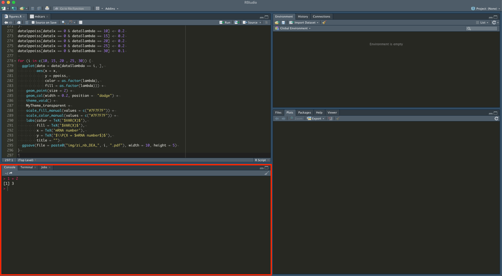

The goal of this practical is to familiarize yourself with R and the RStudio
environment.

# Some R background

```{r, out.width = "40px",echo=FALSE}
knitr::include_graphics("img/Rlogo.png")
```
is a programming language and free software environment for statistical
computing and graphics supported by the *R Foundation for Statistical Computing*.

---


```{r, out.width = "40px",echo=FALSE}
knitr::include_graphics("img/Rlogo.png")
```

- created by **Ross Ihaka** and **Robert Gentleman**
- free and opensource implementation the S programming language
- initial version released in 1995
- at the University of Auckland, New Zealand
- currently developed by the **R Development Core Team**.

---

```{r, out.width = "100%",echo=FALSE}
knitr::include_graphics("img/R_terminal.png")
```

# RStudio, the R IDE

\begin{block}{IDR: Integrated development environment}
application that provides {\bf comprehensive facilities} to computer programmers for
software development
\end{block}

## An interface


## The same console as before



## A code editor


## Various outpus


## The environment


