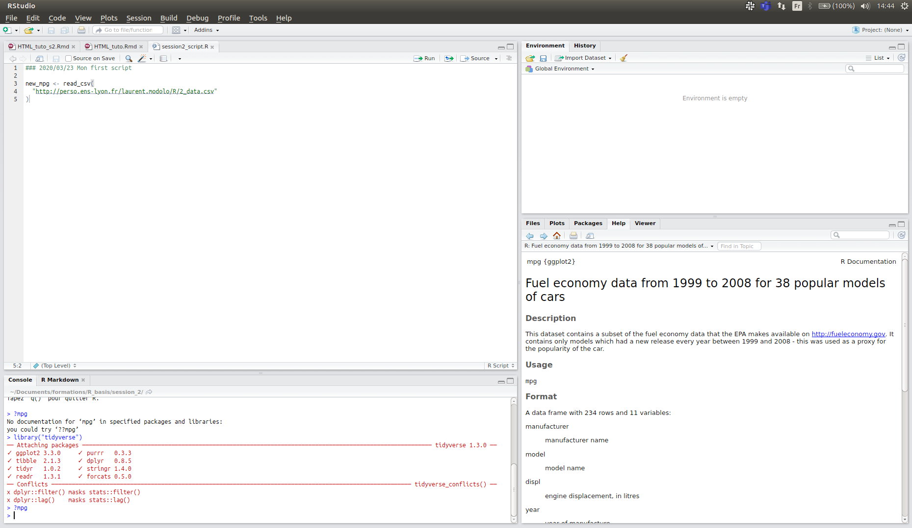
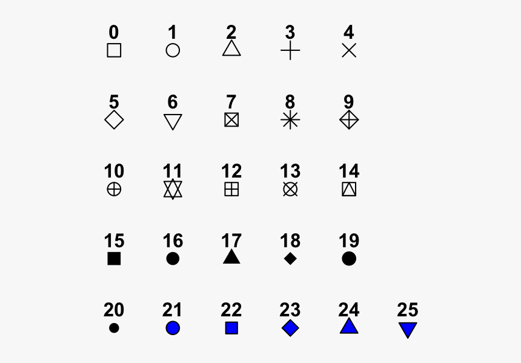

```{r include=FALSE}
library(fontawesome)

if("conflicted" %in% .packages())
    conflicted::conflicts_prefer(dplyr::filter)
``` 

```{r setup, include=FALSE}
rm(list=ls())
knitr::opts_chunk$set(echo = TRUE)
knitr::opts_chunk$set(comment = NA)
```

```{r download_data, include=FALSE, eval=T}
library("tidyverse")
tmp <- tempfile(fileext = ".zip")
download.file("http://www.fueleconomy.gov/feg/epadata/vehicles.csv.zip",
              tmp,
              quiet = TRUE)
unzip(tmp, exdir = "data-raw")
new_class_level <- c(
  "Compact Cars",
  "Large Cars",
  "Midsize Cars",
  "Midsize Cars",
  "Midsize Cars",
  "Compact Cars",
  "Minivan",
  "Minivan",
  "Pickup Trucks",
  "Pickup Trucks",
  "Pickup Trucks",
  "Sport Utility Vehicle",
  "Sport Utility Vehicle",
  "Compact Cars",
  "Special Purpose Vehicle",
  "Special Purpose Vehicle",
  "Special Purpose Vehicle",
  "Special Purpose Vehicle",
  "Special Purpose Vehicle",
  "Special Purpose Vehicle",
  "Sport Utility Vehicle",
  "Sport Utility Vehicle",
  "Pickup Trucks",
  "Pickup Trucks",
  "Pickup Trucks",
  "Pickup Trucks",
  "Sport Utility Vehicle",
  "Sport Utility Vehicle",
  "Compact Cars",
  "Two Seaters",
  "Vans",
  "Vans",
  "Vans",
  "Vans"
)
new_fuel_level <- c(
  "gas",
  "Diesel",
  "Regular",
  "gas",
  "gas",
  "Regular",
  "Regular",
  "Hybrid",
  "Hybrid",
  "Regular",
  "Regular",
  "Hybrid",
  "Hybrid"
)
read_csv("data-raw/vehicles.csv") %>%
  select(
    "id",
    "make",
    "model",
    "year",
    "VClass",
    "trany",
    "drive",
    "cylinders",
    "displ",
    "fuelType",
    "highway08",
    "city08"
  ) %>%
  rename(
    "class" = "VClass",
    "trans" = "trany",
    "drive" = "drive",
    "cyl" = "cylinders",
    "displ" = "displ",
    "fuel" = "fuelType",
    "hwy" = "highway08",
    "cty" = "city08"
  ) %>%
  filter(drive != "") %>%
  drop_na() %>%
  arrange(make, model, year) %>%
  mutate(class = factor(as.factor(class), labels = new_class_level)) %>%
  mutate(fuel = factor(as.factor(fuel), labels = new_fuel_level)) %>%
  write_csv("mpg.csv")
```

# Introduction

In the last session, we have gone through the basis of R.
Instead of continuing to learn more about R programming, in this session we are going to jump directly to rendering plots.

We make this choice for three reasons:

- Rendering nice plots is directly rewarding
- You will be able to apply what you learn in this session to your own data (given that they are *correctly formatted*)
- We will come back to R programming later, when you have all the necessary tools to visualize your results.


The objectives of this session will be to:

- Create basic plot with the `ggplot2` `library`
- Understand the `tibble` type
- Learn the different aesthetics in R plots
- Compose complex graphics

## Tidyverse

The `tidyverse` package is a collection of R packages designed for data science that include `ggplot2`.

All packages share an underlying design philosophy, grammar, and data structures (plus the same shape of logo).

<center>
{width=500px}
</center>

`tidyverse` is a meta library, which can be long to install with the following command:
```R
install.packages("tidyverse")
```

Luckily for you, `tidyverse` is preinstalled on your Rstudio server. So you just have to load the ` library`

```{R load_tidyverse}
library("tidyverse")
```
 
## Toy data set `mpg`

This dataset contains a subset of the fuel economy data that the EPA makes available on [fueleconomy.gov](http://fueleconomy.gov).
It contains only models which had a new release every year between 1999 and 2008.

You can use the `?` command to know more about this dataset.

```{r mpg_inspect, include=TRUE}
?mpg
```

But instead of using a dataset included in a R package, you may want to be able to use any dataset with the same format.
For that we are going to use the command `read_csv` which is able to read a [csv](https://en.wikipedia.org/wiki/Comma-separated_values) file.

This command also works for file URL

```{r mpg_download_local, cache=TRUE, message=FALSE, echo = F, include=F}
new_mpg <- read_csv("./mpg.csv")
```

```{r mpg_download, cache=TRUE, message=FALSE, eval = F}
new_mpg <- read_csv(
  "https://can.gitbiopages.ens-lyon.fr/R_basis/session_2/mpg.csv"
)
```

You can check the number of lines and columns of the data with `dim`:

```{r mpg_inspect2, include=TRUE}
dim(new_mpg)
```

To visualize the data in Rstudio you can use the command. `View`

```R
View(new_mpg)
```

Or by simply calling the variable.
Like for simple data type calling a variable print it.
But complex data type like `new_mpg` can use complex print function.

```{r mpg_inspect3, include=TRUE}
new_mpg
```

Here we can see that `new_mpg` is a `tibble` we will come back to `tibble` later.


## New script

Like in the last session, instead of typing your commands directly in the console, you are going to write them in an R script.



# First plot with `ggplot2`

We are going to make the simplest plot possible to study the relationship between two variables: the scatterplot.

The following command generates a plot between engine size `displ` and fuel efficiency `hwy` present the `new_mpg` `tibble`.

```{r new_mpg_plot_a, cache = TRUE, fig.width=8, fig.height=4.5}
ggplot(data = new_mpg) + 
  geom_point(mapping = aes(x = displ, y = hwy))
```

<div class="pencadre">
Are cars with bigger engines less fuel efficient ? 
</div>

`ggplot2` is a system for declaratively creating graphics, based on [The Grammar of Graphics](https://www.amazon.com/Grammar-Graphics-Statistics-Computing/dp/0387245448/ref=as_li_ss_tl). You provide the data, tell `ggplot2` how to map variables to aesthetics, what graphical primitives to use, and it takes care of the details.

```
ggplot(data = <DATA>) + 
  <GEOM_FUNCTION>(mapping = aes(<MAPPINGS>))
```

- you begin a plot with the function `ggplot()`
- you complete your graph by adding one or more layers
- `geom_point()` adds a layer with a scatterplot
- each **geom **function in `ggplot2` takes a `mapping` argument
- the `mapping` argument is always paired with `aes()`

<div class="pencadre">
What happend when you use only the command `ggplot(data = mpg)` ?
</div>

<details><summary>Solution</summary>
<p>
```{r only_ggplot, cache = TRUE, fig.width=4.5, fig.height=2}
ggplot(data = new_mpg) 
```
</p>
</details>
 
 
<div class="pencadre">
Make a scatterplot of `hwy` ( fuel efficiency ) vs. `cyl` ( number of cylinders ).
</div>
 

<details><summary>Solution</summary>
<p>
```{r new_mpg_plot_b, cache = TRUE, fig.width=8, fig.height=4.5}
ggplot(data = new_mpg, mapping = aes(x = hwy, y = cyl)) + 
  geom_point()
```

</p>

<div class="pencadre">
What seems to be the problem ?
</div>

<details><summary>Solution</summary>
<p>
Dots with the same coordinates are superposed.

</p>
</details>


</details>
 
# Aesthetic mappings

`ggplot2` will automatically assign a unique level of the aesthetic (here a unique color) to each unique value of the variable, a process known as scaling. `ggplot2` will also add a legend that explains which levels correspond to which values.

Try the following aesthetic:

- `size`
- `alpha`
- `shape`

## `color` mapping

```{r new_mpg_plot_e, cache = TRUE, fig.width=8, fig.height=4.5}
ggplot(data = new_mpg, mapping = aes(x = displ, y = hwy, color = class)) + 
  geom_point()
```


## `size` mapping

```{r new_mpg_plot_f, cache = TRUE, fig.width=8, fig.height=4.5, warning=FALSE}
ggplot(data = new_mpg, mapping = aes(x = displ, y = hwy, size = class)) + 
  geom_point()
```

## `alpha` mapping

```{r new_mpg_plot_g, cache = TRUE, fig.width=8, fig.height=4.5, warning=FALSE}
ggplot(data = new_mpg, mapping = aes(x = displ, y = hwy, alpha = class)) + 
  geom_point()
```

## `shape` mapping

```{r new_mpg_plot_h, cache = TRUE, fig.width=8, fig.height=4.5, warning=FALSE}
ggplot(data = new_mpg, mapping = aes(x = displ, y = hwy, shape = class)) + 
  geom_point()
```

You can also set the aesthetic properties of your **geom** manually. For example, we can make all of the points in our plot blue and squares:

```{r new_mpg_plot_i, cache = TRUE, fig.width=8, fig.height=4.5}
ggplot(data = new_mpg, mapping = aes(x = displ, y = hwy)) + 
  geom_point(color = "blue", shape=0)
```

Here is a list of different shapes available in R:
<center>
{width=300px}
</center>
 
<div class="pencadre">
What’s gone wrong with this code? Why are the points not blue?
</div>

```{r new_mpg_plot_not_blue, cache = TRUE, fig.width=8, fig.height=4.5}
ggplot(data = new_mpg, mapping = aes(x = displ, y = hwy, color = "blue")) + 
  geom_point()
```

<details><summary>Solution</summary>
<p>
```{r new_mpg_plot_blue, cache = TRUE, fig.width=8, fig.height=4.5}
ggplot(data = new_mpg, mapping = aes(x = displ, y = hwy)) + 
  geom_point(color = "blue")
```
</p>
</details>
 
## Mapping a **continuous** variable to a color.

You can also map continuous variable to a color

```{r continu, cache = TRUE, fig.width=8, fig.height=4.5}
ggplot(data = new_mpg, mapping = aes(x = displ, y = hwy, color = cyl)) + 
  geom_point()
```

<div class="pencadre">
What happens if you map an aesthetic to something other than a variable name, like `color = displ < 5`?
</div>

<details><summary>Solution</summary>
<p>
```{r condiColor, cache = TRUE, fig.width=8, fig.height=4.5}
ggplot(data = new_mpg, mapping = aes(x = displ, y = hwy, color = displ < 5)) + 
  geom_point()
```
</p>
</details>
 
# Facets

You can create multiple plots at once by faceting. For this you can use the command `facet_wrap`.
This command takes a formula as input.
We will come back to formulas in R later, for now, you have to know that formulas start with a `~` symbol.

To make a scatterplot of `displ` versus `hwy` per car `class` you can use the following code:

```{r new_mpg_plot_k, cache = TRUE, fig.width=8, fig.height=4.5}
ggplot(data = new_mpg, mapping = aes(x = displ, y = hwy)) + 
  geom_point() + 
  facet_wrap(~class, nrow = 2)
```

<div class="pencadre">
Now try to facet your plot by `fuel + class`
</div>


<details><summary>Solution</summary>
<p>
Formulas allow you to express complex relationship between variables in R !

```{r new_mpg_plot_l, cache = TRUE, fig.width=8, fig.height=4.5}
ggplot(data = new_mpg, mapping = aes(x = displ, y = hwy)) +
  geom_point() +
  facet_wrap(~ fuel + class, nrow = 2)
```
</p>
</details>

# Composition

There are different ways to represent the information :

```{r new_mpg_plot_o, cache = TRUE, fig.width=8, fig.height=4.5}
ggplot(data = new_mpg, mapping = aes(x = displ, y = hwy)) + 
  geom_point()
```

 \ 

```{r new_mpg_plot_p, cache = TRUE, fig.width=8, fig.height=4.5, message=FALSE}
ggplot(data = new_mpg, mapping = aes(x = displ, y = hwy)) + 
  geom_smooth()
```

 \ 

We can add as many layers as we want

```{r new_mpg_plot_q, cache = TRUE, fig.width=8, fig.height=4.5, message=FALSE}
ggplot(data = new_mpg, mapping = aes(x = displ, y = hwy)) + 
  geom_point() +
  geom_smooth()
```

 \

We can make `mapping` layer specific

```{r new_mpg_plot_s, cache = TRUE, fig.width=8, fig.height=4.5, message=FALSE}
ggplot(data = new_mpg, mapping = aes(x = displ, y = hwy)) + 
  geom_point(mapping = aes(color = class)) +
  geom_smooth()
```

 \ 

We can use different `data` (here new_mpg and mpg tables) for different layers (you will lean more on `filter()` later)

```{r new_mpg_plot_t, cache = TRUE, fig.width=8, fig.height=4.5, message=FALSE}
ggplot(data = new_mpg, mapping = aes(x = displ, y = hwy)) + 
  geom_point(mapping = aes(color = class)) +
  geom_smooth(data = filter(mpg, class == "subcompact"))
```

# Challenge  !

## First challenge
<div class="pencadre">
Run this code in your head and predict what the output will look like. Then, run the code in R and check your predictions.
</div>
```R
ggplot(data = new_mpg, mapping = aes(x = displ, y = hwy, color = drive)) + 
  geom_point(show.legend = FALSE) + 
  geom_smooth(se = FALSE)
```

<div class="pencadre">
- What does `show.legend = FALSE` do?
- What does the `se` argument to `geom_smooth()` do?
</div>


<details><summary>Solution</summary>
<p>
```{r soluce_challenge_1, cache = TRUE, fig.width=8, fig.height=4.5}
ggplot(data = new_mpg, mapping = aes(x = displ, y = hwy, color = drive)) + 
  geom_point(show.legend = FALSE) + 
  geom_smooth(se = FALSE)
```
</p>
</details>


## Second challenge

<div class="pencadre">
How being a `Two Seaters` car (*class column*) impact the engine size (*displ column*) versus fuel efficiency relationship (*hwy column*) ?

1. Make a plot of `hwy` in function of `displ ` 
1. *Colorize* this plot in another color for `Two Seaters` class
2. *Split* this plot for each *class*

</div>

<details><summary>Solution 1</summary>
<p>

```{r new_mpg_plot_color_2seater1, cache = TRUE, fig.width=8, fig.height=4.5}
ggplot(data = new_mpg, mapping = aes(x = displ, y = hwy)) + 
  geom_point()
```

</p>
</details>

<details><summary>Solution 2</summary>
<p>
```{r new_mpg_plot_color_2seater2, cache = TRUE, fig.width=8, fig.height=4.5}
ggplot(data = new_mpg, mapping = aes(x = displ, y = hwy)) + 
  geom_point() +
  geom_point(data = filter(new_mpg, class == "Two Seaters"), color = "red")
```

</p>
</details>

<details><summary>Solution 3</summary>
<p>

```{r new_mpg_plot_color_2seater_facet, cache = TRUE, fig.width=8, fig.height=4.5}
ggplot(data = new_mpg, mapping = aes(x = displ, y = hwy)) + 
  geom_point() +
  geom_point(data = filter(new_mpg, class == "Two Seaters"), color = "red") +
  facet_wrap(~class)
```

</p>
</details>


<div class="pencadre">
Write a `function` called `plot_color_a_class` that can take as argument the class and plot the same graph for this class
</div>

<details><summary>Solution</summary>
<p>
```{r new_mpg_plot_color_2seater_fx, cache = TRUE, fig.width=8, fig.height=4.5}
plot_color_a_class <- function(my_class) {
  ggplot(data = new_mpg, mapping = aes(x = displ, y = hwy)) + 
    geom_point() +
    geom_point(data = filter(new_mpg, class == my_class), color = "red") +
    facet_wrap(~class)
}
plot_color_a_class("Two Seaters")
plot_color_a_class("Compact Cars")

```
</p>
</details>


## Third challenge

<div class="pencadre">
Recreate the R code necessary to generate the following graph (see "linetype" option of "geom_smooth")
</div>

```{r new_mpg_plot_u, echo = FALSE, cache = TRUE, fig.width=8, fig.height=4.5, message=FALSE}
ggplot(data = new_mpg, mapping = aes(x = displ, y = hwy, color = fuel)) +
  geom_point() +
  geom_smooth(linetype = "dashed", color = "black") +
  facet_wrap(~fuel)
```

<details><summary>Solution</summary>
<p>
```{r new_mpg_plot_v, eval=F}
ggplot(data = new_mpg, mapping = aes(x = displ, y = hwy, color = fuel)) +
  geom_point() +
  geom_smooth(linetype = "dashed", color = "black") +
  facet_wrap(~fuel)
```
</p>
</details>

## See you in [R.3: Transformations with ggplot2](https://can.gitbiopages.ens-lyon.fr/R_basis/session_3.html)

# To go further: publication ready plots

Once you have created the graph you need for your publication, you have to save it.
You can do it with the `ggsave` function.

First save your plot in a variable :

```{r}
p1 <- ggplot(data = new_mpg, mapping = aes(x = displ, y = hwy, color = class)) + 
      geom_point()
```

Then save it in the wanted format:

```{r, eval=F}
ggsave("test_plot_1.png", p1, width = 12, height = 8, units = "cm")
```

```{r, eval=F}
ggsave("test_plot_1.pdf", p1, width = 12, height = 8, units = "cm")
```

You may also change the appearance of your plot by adding a `theme` layer to your plot:

```{r,fig.width=8, fig.height=4.5, message=FALSE}
p1 + theme_bw()
```

```{r,fig.width=8, fig.height=4.5, message=FALSE}
p1 + theme_minimal()
```

You may have to combine several plots, for that you can use the `cowplot` package which is a `ggplot2` extension.
First install it :


```{r, eval=F}
install.packages("cowplot")
```

```{r, include=F, echo =F}
if (! require("cowplot")) {
  install.packages("cowplot")
}
```

Then you can use the function `plot` grid to combine plots in a publication ready style:

```{r,message=FALSE}
library(cowplot)
```

```{r,fig.width=8, fig.height=4.5, message=FALSE}
p1 <- ggplot(data = new_mpg) + 
  geom_point(mapping = aes(x = displ, y = hwy))
p1
```


```{r,fig.width=8, fig.height=4.5, message=FALSE}
p2 <- ggplot(data = new_mpg, mapping = aes(x = cty, y = hwy)) + 
  geom_point()
p2
```


```{r,fig.width=8, fig.height=4.5, message=FALSE}
plot_grid(p1, p2, labels = c('A', 'B'), label_size = 12)
```

You can also save it in a file.

```{r, eval=F}
p_final = plot_grid(p1, p2, labels = c('A', 'B'), label_size = 12)
ggsave("test_plot_1_and_2.png", p_final, width = 20, height = 8, units = "cm")
```

You can learn more features about `cowplot` on [https://wilkelab.org/cowplot/articles/introduction.html](its website). 

<div class="pencadre">
Use the `cowplot` documentation to reproduce this plot and save it.
</div>

```{r, echo=F}
p1 <- ggplot(data = new_mpg, mapping = aes(x = displ, y = hwy, color = class)) + 
  geom_point() + theme_bw()

p2 <- ggplot(data = new_mpg, mapping = aes(x = cty, y = hwy, color = class)) + 
  geom_point() + theme_bw()

p_row <- plot_grid(p1 + theme(legend.position = "none"), p2 + theme(legend.position = "none"), labels = c('A', 'B'), label_size = 12)
p_legend <- get_legend(p1 + theme(legend.position = "top"))

plot_grid(p_row, p_legend, nrow = 2, rel_heights = c(1,0.2))
```

<details><summary>Solution</summary>
<p>
```{r , echo = TRUE, eval = F}
p1 <- ggplot(data = new_mpg, mapping = aes(x = displ, y = hwy, color = class)) + 
  geom_point() + theme_bw()

p2 <- ggplot(data = new_mpg, mapping = aes(x = cty, y = hwy, color = class)) + 
  geom_point() + theme_bw()

p_row <- plot_grid(p1 + theme(legend.position = "none"), p2 + theme(legend.position = "none"), labels = c('A', 'B'), label_size = 12)
p_legend <- get_legend(p1 + theme(legend.position = "top"))

p_final <- plot_grid(p_row, p_legend, nrow = 2, rel_heights = c(1,0.2))
p_final
```

```{r , echo = TRUE, eval = F}
ggsave("plot_1_2_and_legend.png", p_final, width = 20, height = 8, units = "cm")
```

</p>
</details>

There are a lot of other available `ggplot2` extensions which can be useful (and also beautiful).
You can take a look at them here: [https://exts.ggplot2.tidyverse.org/gallery/]( ggplot2 gallery)
