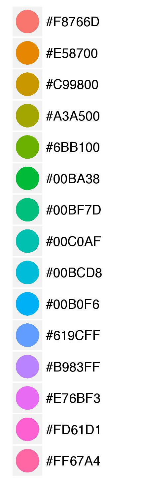

<style type="text/css">
h3 { /* Header 3 */
  position: relative ;
  color: #729FCF ;
  left: 5%;
}
h2 { /* Header 2 */
  color: darkblue ;
  left: 10%;
} 
h1 { /* Header 1 */
  color: #034b6f ;
} 
#pencadre{
  border:1px; 
  border-style:solid; 
  border-color: #034b6f; 
  background-color: #EEF3F9; 
  padding: 1em;
  text-align: center ;
  border-radius : 5px 4px 3px 2px;
}
legend{
  color: #034b6f ;
}
#pquestion {
  color: darkgreen;
  font-weight: bold;
  
}
}
</style>
```{r setup, include=FALSE}
knitr::opts_chunk$set(echo = TRUE)

library(tidyverse)
# tmp <- tempfile(fileext = ".zip")
# download.file("http://www.fueleconomy.gov/feg/epadata/vehicles.csv.zip",
#               tmp,
#               quiet = TRUE)
# unzip(tmp, exdir = "data-raw")
# new_class_level <- c(
#   "Compact Cars",
#   "Large Cars",
#   "Midsize Cars",
#   "Midsize Cars",
#   "Midsize Cars",
#   "Compact Cars",
#   "Minivan",
#   "Minivan",
#   "Pickup Trucks",
#   "Pickup Trucks",
#   "Pickup Trucks",
#   "Sport Utility Vehicle",
#   "Sport Utility Vehicle",
#   "Compact Cars",
#   "Special Purpose Vehicle",
#   "Special Purpose Vehicle",
#   "Special Purpose Vehicle",
#   "Special Purpose Vehicle",
#   "Special Purpose Vehicle",
#   "Special Purpose Vehicle",
#   "Sport Utility Vehicle",
#   "Sport Utility Vehicle",
#   "Pickup Trucks",
#   "Pickup Trucks",
#   "Pickup Trucks",
#   "Pickup Trucks",
#   "Sport Utility Vehicle",
#   "Sport Utility Vehicle",
#   "Compact Cars",
#   "Two Seaters",
#   "Vans",
#   "Vans",
#   "Vans",
#   "Vans"
# )
# new_fuel_level <- c(
#   "gas",
#   "Diesel",
#   "Regular",
#   "gas",
#   "gas",
#   "Regular",
#   "Regular",
#   "Hybrid",
#   "Hybrid",
#   "Regular",
#   "Regular",
#   "Hybrid",
#   "Hybrid"
# )
# read_csv("data-raw/vehicles.csv") %>%
#   select(
#     "id",
#     "make",
#     "model",
#     "year",
#     "VClass",
#     "trany",
#     "drive",
#     "cylinders",
#     "displ",
#     "fuelType",
#     "highway08",
#     "city08"
#   ) %>% 
#   rename(
#     "class" = "VClass",
#     "trans" = "trany",
#     "drive" = "drive",
#     "cyl" = "cylinders",
#     "displ" = "displ",
#     "fuel" = "fuelType",
#     "hwy" = "highway08",
#     "cty" = "city08"
#   ) %>%
#   filter(drive != "") %>%
#   drop_na() %>% 
#   arrange(make, model, year) %>%
#   mutate(class = factor(as.factor(class), labels = new_class_level)) %>%
#   mutate(fuel = factor(as.factor(fuel), labels = new_fuel_level)) %>%
#   write_csv("2_data.csv")

```


The goal of this practical is to familiarize yourself with `ggplot2`.

The objectives of this session will be to:

- Create basic plot with `ggplot2`
- Understand the `tibble` type
- Learn the different aesthetics in R plots
- Compose graphics


<div id='pencadre'>

**Write the commands in the grey box in the terminal.**

**The expected results will always be printed in a white box here.**

**You can `copy-paste` but I advise you to practice writing directly in the terminal. To validate the line at the end of your command: press `Return`.**
</div> 


## Tidyverse

The tidyverse is a collection of R packages designed for data science.

All packages share an underlying design philosophy, grammar, and data structures.

<center>
{width=500px}
</center>

 \ 
```R
install.packages("tidyverse")
```

```R
library("tidyverse")
```

 \ 
 
### Toy data set `mpg`

This dataset contains a subset of the fuel economy data that the EPA makes available on http://fueleconomy.gov . It contains only models which had a new release every year between 1999 and 2008.


```{r mpg_inspect, include=TRUE}
?mpg
mpg
```

```{r mpg_inspect2, include=TRUE}
dim(mpg)
```

```R
View(mpg)
```
### New script


 \ 

<!-- ### Updated version of the data -->

<!-- `mpg` is loaded with tidyverse, we want to be able to read our own data from -->

<!--  \  -->
<!-- http://perso.ens-lyon.fr/laurent.modolo/R/2_data.csv -->

<!-- ```{r mpg_download, cache=TRUE, message=FALSE} -->
<!-- new_mpg <- read_csv( -->
<!--   "http://perso.ens-lyon.fr/laurent.modolo/R/2_data.csv" -->
<!--   ) -->

<!-- ``` -->

 \ 
 
 \ 

# First plot with `ggplot2`

Relationship between engine size `displ` and fuel efficiency `hwy`.

```{r new_mpg_plot_a, cache = TRUE, fig.width=8, fig.height=4.5}
ggplot(data = mpg, mapping = aes(x = displ, y = hwy)) + 
  geom_point()

```

### Composition of plot with `ggplot2`


```
ggplot(data = <DATA>) + 
  <GEOM_FUNCTION>(mapping = aes(<MAPPINGS>))
```

- you begin a plot with the function `ggplot()`
- you complete your graph by adding one or more layers
- `geom_point()` adds a layer with a scatterplot
- each geom function in `ggplot2` takes a `mapping` argument
- the `mapping` argument is always paired with `aes()`

 \ 
 

<div id="pquestion"> - Make a scatterplot of `hwy` ( fuel efficiency ) vs. `cyl` ( number of cylinders ). </div>

 \ 
 
 \ 
 
 \ 
 
 \ 
 
 \ 
 
 \ 
 
 \ 
 
 \ 
 
 


```{r new_mpg_plot_b, cache = TRUE, fig.width=8, fig.height=4.5}
ggplot(data = mpg, mapping = aes(x = hwy, y = cyl)) + 
  geom_point()
```

 \ 
 

 \ 
 
# Aesthetic mappings


`ggplot2` will automatically assign a unique level of the aesthetic (here a unique color) to each unique value of the variable, a process known as scaling. `ggplot2` will also add a legend that explains which levels correspond to which values.

Try the following aesthetic:

- `size`
- `alpha`
- `shape`

### Aesthetic mappings : `color`

```{r new_mpg_plot_e, cache = TRUE, fig.width=8, fig.height=4.5}
ggplot(data = mpg, mapping = aes(x = displ, y = hwy, color = class)) + 
  geom_point()
```


### Aesthetic mappings : `size`

```{r new_mpg_plot_f, cache = TRUE, fig.width=8, fig.height=4.5, warning=FALSE}
ggplot(data = mpg, mapping = aes(x = displ, y = hwy, size = class)) + 
  geom_point()
```

###  Aesthetic mapping : `alpha`

```{r new_mpg_plot_g, cache = TRUE, fig.width=8, fig.height=4.5, warning=FALSE}
ggplot(data = mpg, mapping = aes(x = displ, y = hwy, alpha = class)) + 
  geom_point()
```

###  Aesthetic mapping : `shape`

```{r new_mpg_plot_h, cache = TRUE, fig.width=8, fig.height=4.5, warning=FALSE}
ggplot(data = mpg, mapping = aes(x = displ, y = hwy, shape = class)) + 
  geom_point()
```

 
 \ 

You can also set the aesthetic properties of your geom manually. For example, we can make all of the points in our plot blue and squares:

```{r new_mpg_plot_i, cache = TRUE, fig.width=8, fig.height=4.5}
ggplot(data = mpg, mapping = aes(x = displ, y = hwy)) + 
  geom_point(color = "blue", shape=0)
```


 \ 
<center>
{width=300px}

 \ 
 
{width=100px} 
</center>

<div id="pquestion">- What’s gone wrong with this code? Why are the points not blue?</div>

```R
ggplot(data = mpg, mapping = aes(x = displ, y = hwy, color = "blue")) + 
  geom_point()
```
 \ 
 
 \ 
 
 \ 
 
 \ 
 
 \ 
 
 \ 
 
 \ 

```{r res2, cache = TRUE, echo=FALSE, fig.width=8, fig.height=4.5}
ggplot(data = mpg, mapping = aes(x = displ, y = hwy, color = "blue")) + 
  geom_point()
```

 \ 
 
- Map a **continuous** variable to color.

```{r continu, cache = TRUE, fig.width=8, fig.height=4.5}
ggplot(data = mpg, mapping = aes(x = displ, y = hwy, color = cyl)) + 
  geom_point()
```

<div id="pquestion">- What happens if you map an aesthetic to something other than a variable name, like `color = displ < 5`?</div>
```{r condiColor, cache = TRUE, fig.width=8, fig.height=4.5}
ggplot(data = mpg, mapping = aes(x = displ, y = hwy, color = displ < 5)) + 
  geom_point()
```

 \ 
 
 \ 
 
# Facets


```{r new_mpg_plot_k, cache = TRUE, fig.width=8, fig.height=4.5}
ggplot(data = mpg, mapping = aes(x = displ, y = hwy)) + 
  geom_point() + 
  facet_wrap(~class, nrow = 2)
```

 \ 

```{r new_mpg_plot_l, cache = TRUE, fig.width=8, fig.height=4.5}
ggplot(data = mpg, mapping = aes(x = displ, y = hwy)) + 
  geom_point() + 
  facet_wrap(~ fl + class, nrow = 2)
```

# Composition

There are different ways to represent the information :

```{r new_mpg_plot_o, cache = TRUE, fig.width=8, fig.height=4.5}
ggplot(data = mpg, mapping = aes(x = displ, y = hwy)) + 
  geom_point()
```

 \ 

```{r new_mpg_plot_p, cache = TRUE, fig.width=8, fig.height=4.5, message=FALSE}
ggplot(data = mpg, mapping = aes(x = displ, y = hwy)) + 
  geom_smooth()
```

 \ 

We can add as many layers as we want

```{r new_mpg_plot_q, cache = TRUE, fig.width=8, fig.height=4.5, message=FALSE}
ggplot(data = mpg, mapping = aes(x = displ, y = hwy)) + 
  geom_point() +
  geom_smooth()
```

 \

We can make `mapping` layer specific

```{r new_mpg_plot_s, cache = TRUE, fig.width=8, fig.height=4.5, message=FALSE}
ggplot(data = mpg, mapping = aes(x = displ, y = hwy)) + 
  geom_point(mapping = aes(color = class)) +
  geom_smooth()
```

 \ 

We can use different `data` for different layer (You will lean more on `filter()` later)

```{r new_mpg_plot_t, cache = TRUE, fig.width=8, fig.height=4.5, message=FALSE}
ggplot(data = mpg, mapping = aes(x = displ, y = hwy)) + 
  geom_point(mapping = aes(color = class)) +
  geom_smooth(data = filter(mpg, class == "subcompact"))
```

# Challenge  !

<div id="pquestion">- Run this code in your head and predict what the output will look like. Then, run the code in R and check your predictions.</div>
```R
ggplot(data = mpg, mapping = aes(x = displ, y = hwy, color = drv)) + 
  geom_point() + 
  geom_smooth(se = FALSE)
```
**http://perso.ens-lyon.fr/laurent.modolo/R/2_d**

- What does `show.legend = FALSE` do?
- What does the `se` argument to `geom_smooth()` do?

## Third challenge

- Recreate the R code necessary to generate the following graph

```{r new_mpg_plot_u, echo = FALSE, cache = TRUE, fig.width=8, fig.height=4.5, message=FALSE}
ggplot(data = mpg, mapping = aes(x = displ, y = hwy, color = drv)) + 
  geom_point() +
  geom_smooth(mapping = aes(linetype = drv))
```

## Third challenge

```{r new_mpg_plot_v, cache = TRUE, fig.width=8, fig.height=4.5, message=FALSE}
ggplot(data = mpg, mapping = aes(x = displ, y = hwy, color = drv)) + 
  geom_point() +
  geom_smooth(mapping = aes(linetype = drv))
```