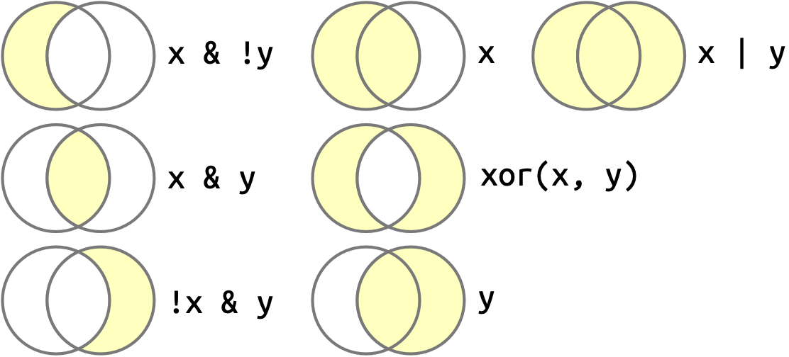
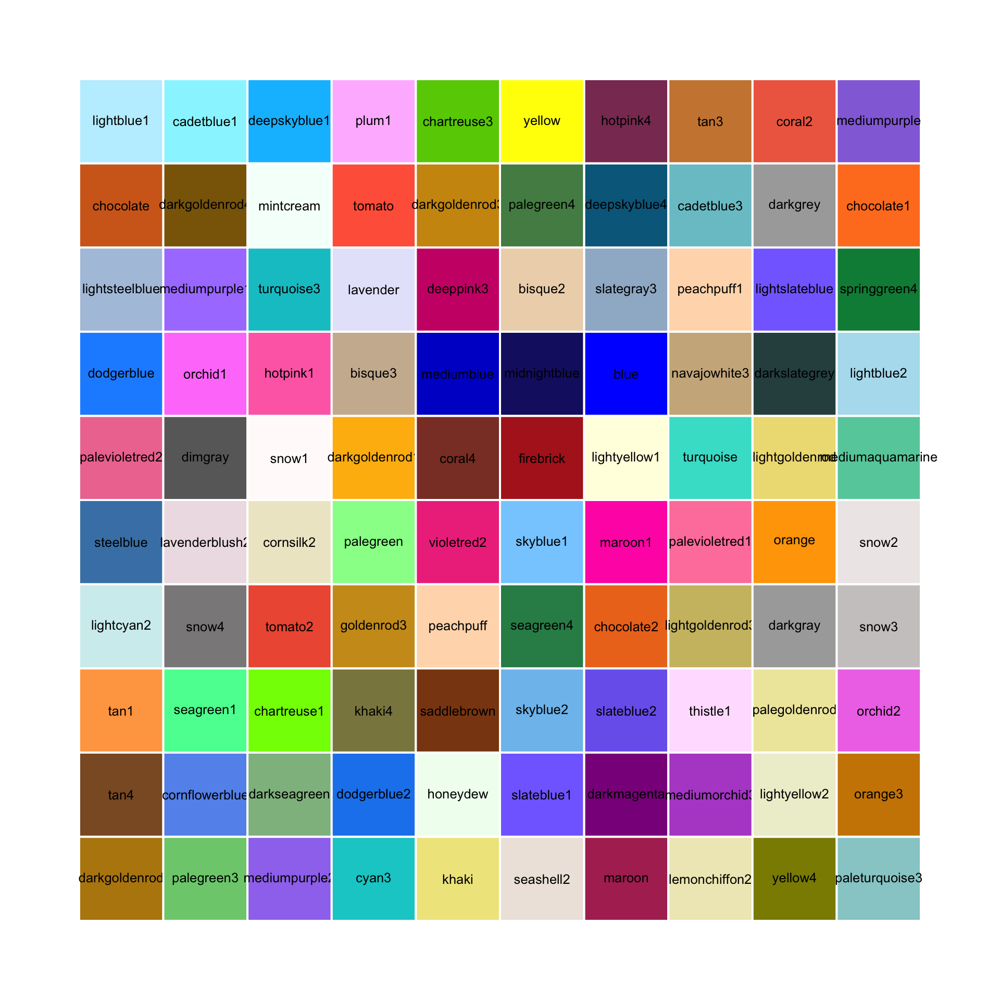

```{r include=FALSE}
library(fontawesome)
``` 

&ensp;`r fa(name = "fas fa-house", fill = "grey", height = "1em")` &ensp;https://can.gitbiopages.ens-lyon.fr/R_basis/

```{r setup, include=FALSE}
rm(list=ls())
knitr::opts_chunk$set(echo = TRUE)
knitr::opts_chunk$set(comment = NA)
```
```{r klippy, echo=FALSE, include=TRUE}
klippy::klippy(
  position = c('top', 'right'),
  color = "white",
  tooltip_message = 'Click to copy',
  tooltip_success = 'Copied !')
```

# Introduction

The goal of this practical is to practice data transformation with `tidyverse`.
The objectives of this session will be to:

- Filter rows with `filter()`
- Arrange rows with `arrange()`
- Select columns with `select()`
- Add new variables with `mutate()`

<div class="pencadre">
For this session we are going to work with a new dataset included in the `nycflights13` package.
Install this package and load it.
As usual you will also need the `tidyverse` library.
</div>

<details><summary>Solution</summary>
  <p> 
  
```{r installP, eval = F}
install.packages("nycflights13")
```

```{r packageloaded, include=TRUE, message=FALSE}
library("tidyverse")
library("nycflights13")
```
  </p>
</details>
 
## Data set : nycflights13

`nycflights13::flights` Contains all 336,776 flights that departed from New York City in 2013.
The data comes from the US Bureau of Transportation Statistics, and is documented in `?flights`

```R
?flights
```

You can display the first rows of the dataset to have an overview of the data.

```{r display_data, include=TRUE}
flights
```

To know all the colnames of a table you can use the function `colnames(dataset)`

```{r display_colnames, include=TRUE}
colnames(flights)
```


## Data type

In programming languages, all variables are not equal.
When you display a `tibble` you can see the **type** of a column.
Here is a list of common variable **types** that you will encounter

- **int** stands for integers.
- **dbl** stands for doubles or real numbers.
- **chr** stands for character vectors or strings.
- **dttm** stands for date-times (a date + a time).
- **lgl** stands for logical, vectors that contain only `TRUE` or `FALSE`.
- **fctr** stands for factors, which R uses to represent categorical variables with fixed possible values.
- **date** stands for dates.

You cannot add an **int** to a **chr**, but you can add an **int** to a **dbl** the results will be a **dbl**.
 
# `filter` rows

Variable **types** are important to keep in mind for comparisons.
The `filter()` function allows you to subset observations based on their values.

The good reflex to take when you meet a new function of a package is to look at the help with `?function_name` to learn how to use it and to know the different arguments.

```R
?filter
```


## Use test to filter on a column

You can use the relational operators (`<`,`>`,`==`,`<=`,`>=`,`!=`) to make a test on a column and keep rows for which the results is `TRUE`.

```{r filter_sup_eq, include=TRUE, eval=FALSE}
filter(flights, air_time >= 680)
filter(flights, carrier ==  "HA")
filter(flights, origin !=  "JFK")
```
The operator `%in%` is very usefull to test if a value is in a list.

```{r filter_sup_inf, include=TRUE, eval=FALSE}
filter(flights, carrier %in% c("OO","AS"))
filter(flights, month %in% c(5,6,7,12))
```


`dplyr` functions never modify their inputs, so if you want to save the result, you’ll need to use the assignment operator, `<-`

<div class="pencadre">
Save the flights longer than 680 minutes in a `long_flights` variable
</div> 
 
<details><summary>Solution</summary>
<p>

```{r filter_day_sav, include=TRUE}
long_flights <- filter(flights, air_time >= 680)
```
</p>
</details>


## Logical operators to filter on several columns

Multiple arguments to `filter()` are combined with **AND**: every expression must be `TRUE` in order for a row to be included in the output.

```{r filter_month_day_sav, include=TRUE}
filter(flights, month == 12, day == 25)
```


In R you can use the symbols `&` (and), `|` (or), `!` (not) and the function `xor()` to build other kinds of tests.




<div class="pencadre">
Display the `long_flights` variable and predict the results of 

```{r logical_operators_exemples2, eval=FALSE}
filter(long_flights,  day <= 15 & carrier == "HA")
filter(long_flights,  day <= 15 | carrier == "HA")
filter(long_flights,  (day <= 15 | carrier == "HA") & (! month > 2))
```


</div> 
 
<details><summary>Solution</summary>
<p>

```{r logical_operators_exemples2_sol, include=TRUE}
long_flights

filter(long_flights,  day <= 15 & carrier == "HA")
filter(long_flights,  day <= 15 | carrier == "HA")
filter(long_flights,  (day <= 15 | carrier == "HA") & (! month > 2))
```
</p>
</details>


<div class="pencadre">
Test the following operations and translate them with words

```{r filter_logical_operators_a, eval=FALSE}
filter(flights, month == 11 | month == 12)
```

```{r filter_logical_operators_b, eval=FALSE}
filter(flights, month %in% c(11, 12))
```

```{r filter_logical_operators_c, eval=FALSE}
filter(flights, !(arr_delay > 120 | dep_delay > 120))
```

```{r filter_logical_operators_d, eval=FALSE}
filter(flights, arr_delay <= 120 & dep_delay <= 120)
```

```{r filter_logical_operators_e, eval=FALSE}
filter(flights, arr_delay <= 120, dep_delay <= 120)
```

</div>

Combinations of logical operators is a powerful programmatic way to select subset of data.
Keep in mind, however, that long logical expression can be hard to read and understand, so it may be easier to apply successive small filters instead of one long one.


<div class="pencadre">
R either prints out the results, or saves them to a variable.
What happens when you put your variable assignment code between parenthesis `(` `)` ?

```{r filter_month_day_sav_display, eval=FALSE}
(dec25 <- filter(flights, month == 12, day == 25))
```
</div>

## Missing values

One important feature of R that can make comparison tricky is missing values, or `NA`s for **Not Availables**.
Indeed each of the variable type can contain either a value of this type (i.e., `2` for an **int**) or nothing.
The *nothing recorded in a variable* status is represented with the `NA` symbol.

As operations with `NA` values don t make sense, if you have `NA` somewhere in your operation, the results will be `NA`

```{r filter_logical_operators_NA, include=TRUE}
NA > 5
10 == NA
NA + 10
```

However, you can test for `NA`s with the function `is.na()`:

```{r filter_logical_operators_test_NA, include=TRUE}
is.na(NA)
```

`filter()` only includes rows where the condition is `TRUE`; it excludes both `FALSE` and `NA` values. If you want to preserve missing values, ask for them explicitly:

```{r filter_logical_operators_test_NA2, include=TRUE}
df <- tibble(x = c(1, NA, 3))
filter(df, x > 1)
filter(df, is.na(x) | x > 1)
```

## Challenges

<div class="pencadre">
Find all flights that:
- Had an arrival delay of two or more hours (you can check `?flights`)
- Flew to Houston (IAH or HOU)
</div>

<details><summary>Solution</summary>
<p>
```{r filter_chalenges_b, eval=TRUE}
filter(flights, arr_delay >= 120 & dest %in% c("IAH", "HOU"))
```
</p>
</details>

<div class="pencadre">
How many flights have a missing `dep_time` ?
</div>

<details><summary>Solution</summary>
<p>

```{r filter_chalenges_c, eval=TRUE}
filter(flights, is.na(dep_time))
```
</p>
</details>

<div class="pencadre">
Why is `NA ^ 0` not missing? Why is `NA | TRUE` not missing? Why is `FALSE & NA` not missing? Can you figure out the general rule? (`NA * 0` is a tricky counterexample!)
</div>

<details><summary>Solution</summary>
<p>

```{r filter_chalenges_d, eval=TRUE}
NA ^ 0 # ^ 0 is always 1 it's an arbitrary rule not a computation
NA | TRUE # if a member of a OR operation is TRUE the results is TRUE
FALSE & NA # if a member of a AN operation is FALSE the results is TRUE
NA * 0 # here we have a true computation
```
</p>
</details>

# Arrange rows with `arrange()`

`arrange()` works similarly to `filter()` except that instead of selecting rows, it changes their order.

```{r arrange_ymd, include=TRUE}
arrange(flights, year, month, day)
```

<div class="pencadre">
Use `desc()` to reorder by a column in descending order:
</div>

<details><summary>Solution</summary>
<p>

```{r arrange_desc, include=TRUE}
arrange(flights, desc(dep_delay))
```
</p>
</details>

## Missing values

Missing values are always sorted at the end:

```{r arrange_NA, include=TRUE}
arrange(tibble(x = c(5, 2, NA)), x)
arrange(tibble(x = c(5, 2, NA)), desc(x))
```

## Challenges
<div class="pencadre">

- Find the most delayed flight.
- Find the flight that left earliest.
- How could you arrange all missing values to the start ?

</div>

<details><summary>Solution</summary>
<p>

Find the most delayed flight.
```{r chalange_arrange_desc_a, include=TRUE}
arrange(flights, desc(dep_delay))
```
Find the flight that left earliest.
```{r chalange_arrange_desc_b, include=TRUE}
arrange(flights, dep_delay)
```
How could you arrange all missing values to the start
```{r chalange_arrange_desc_c, include=TRUE}
arrange(tibble(x = c(5, 2, NA)), desc(is.na(x)))
```
</p>
</details>


# Select columns with `select()`

`select()` allows you to rapidly zoom in on a useful subset using operations based on the names of the variables.

You can select by column names
```{r select_ymd_a, include=TRUE}
select(flights, year, month, day)
```

By defining a range of columns
```{r select_ymd_b, include=TRUE}
select(flights, year:day)
```

Or you can do a negative (`-`) to remove columns.
```{r select_ymd_c, include=TRUE}
select(flights, -(year:day))
```

## Helper functions

here are a number of helper functions you can use within `select()`:

- `starts_with("abc")`: matches names that begin with `"abc"`.
- `ends_with("xyz")`: matches names that end with `"xyz"`.
- `contains("ijk")`: matches names that contain `"ijk"`.
- `num_range("x", 1:3)`: matches `x1`, `x2` and `x3`.

See `?select` for more details.

## Challenges

<div class="pencadre">

- Brainstorm as many ways as possible to select `dep_time`, `dep_delay`, `arr_time`, and `arr_delay` from `flights`.
<details><summary>Solution</summary>
<p>

```{r challenge_select_a, eval=FALSE}
select(flights, contains("time") | contains("delay"))
select(flights, contains("_") & !starts_with("sched") & !starts_with("time"))
```
</p>
</details>

- What does the `one_of()` function do? Why might it be helpful in conjunction with this vector? 

```{r select_one_of, eval=T, message=F, cache=T}
vars <- c("year", "month", "day", "dep_delay", "arr_delay")
```

<details><summary>Solution</summary>
<p>

```{r challenge_select_b, eval=FALSE}
select(flights, one_of(vars))
```
</p>
</details>

- Does the result of running the following code surprise you? How do the select helpers deal with case by default? How can you change that default?
```{r select_contains, eval=F, message=F, cache=T}
select(flights, contains("TIME"))
```
<details><summary>Solution</summary>
<p>

```{r challenge_select_c, eval=FALSE}
select(flights, contains("TIME", ignore.case = FALSE))
```
</p>
</details>

</div>
 
# Add new variables with `mutate()`

It’s often useful to add new columns that are functions of existing columns. That’s the job of `mutate()`.

<div class="pencadre">
First let s create a smaller dataset to work on `flights_sml` that contains
- columns from `year` to `day`
- columns that ends with `delays`
- the `distance` and `air_time` columns
</div>

<details><summary>Solution</summary>
<p>

```{r mutate, include=TRUE}
(flights_sml <- select(flights,  year:day, ends_with("delay"), distance, air_time))
```
</p>
</details>

## `mutate()`

```R
mutate(tbl, new_var_a = opperation_a, ..., new_var_n = opperation_n)
```
`mutate()` allows you to add new columns (`new_var_a`, ... , `new_var_n`) and to fill them with the results of an operation.

We can create a `gain` column to check if the pilot managed to compensate is departure delay
```{r mutate_gain}
mutate(flights_sml, gain = dep_delay - arr_delay)
```

<div class="pencadre">
Using `mutate` add a new column `gain` and `speed` that contains the average speed of the plane to the `flights_sml` tibble.
</div>

<details><summary>Solution</summary>
<p>

```{r mutate_reuse, include=TRUE}
flights_sml <- mutate(flights_sml,
  gain = dep_delay - arr_delay,
  speed = distance / air_time * 60
)
``` 
</p>
</details>


<div class="pencadre">
Currently `dep_time` and `sched_dep_time` are convenient to look at, but hard to compute with because they’re not really continuous numbers. Convert them to a more convenient representation of the number of minutes since midnight.
</div>

<details><summary>Solution</summary>
<p>

```{r mutate_challenges_a, eval=F, message=F, cache=T}
mutate(
  flights,
  dep_time = (dep_time %/% 100) * 60 +
    dep_time %% 100,
  sched_dep_time = (sched_dep_time %/% 100) * 60 +
    sched_dep_time %% 100
)
```
</p>
</details>


## Useful creation functions

- Offsets: `lead()` and `lag()` allow you to refer to leading or lagging values. This allows you to compute running differences (e.g. `x - lag(x)`) or find when values change (`x != lag(x)`).
- Cumulative and rolling aggregates: R provides functions for running sums, products, mins and maxes: `cumsum()`, `cumprod()`, `cummin()`, `cummax()`; and dplyr provides `cummean()` for cumulative means. 
- Logical comparisons, `<`, `<=`, `>`, `>=`, `!=`, and `==`
- Ranking: there are a number of ranking functions, but you should start with `min_rank()`. There is also `row_number()`, `dense_rank()`, `percent_rank()`, `cume_dist()`, `ntile()`

## See you in [R#5: Pipping and grouping](https://can.gitbiopages.ens-lyon.fr/R_basis/session_5.html)


# To go further:  Data transformation and color sets.

There are a number of color palettes available in R, thanks to different packages such as `RColorBrewer`, `Viridis` or `Ghibli`. 
We will use them here to decorate our graphs, either on data already studied in the training, `mpg`, or on more specialized data such as lists of differentially expressed genes ( [GSE86356](https://www.ncbi.nlm.nih.gov/geo/query/acc.cgi?acc=GSE86356) )

```{r install_colorPal, eval=F}
install.packages(c("ghibli", "RColorBrewer", "viridis"))
```

```{r load_library}
library(tidyverse)

library(RColorBrewer)
library(ghibli)
library(viridis)
```

## RColorBrewer & Ghibli 

Using `mpg` and the 'ggplot2' package, reproduce the graph studied in session 2, 3.1: color mapping. 
Modify the colors representing the class of cars with the palettes `Dark2` of [RColorBrewer](https://www.datanovia.com/en/fr/blog/palette-de-couleurs-rcolorbrewer-de-a-a-z/), then `MononokeMedium` from [Ghibli](https://github.com/ewenme/ghibli). 

```{r mpg_color}
ggplot(data = mpg, mapping = aes(x = displ, y = hwy, color = class)) + 
  geom_point()
```
Go to the links to find the appropriate function: they are very similar between the two packages.

<details><summary>Solution</summary>
  <p>

```{r mpg_color1}
ggplot(data = mpg, mapping = aes(x = displ, y = hwy, color = class)) + 
  geom_point() +
  scale_color_brewer(palette = "Dark2")
```

```{r mpg_color2}
ggplot(data = mpg, mapping = aes(x = displ, y = hwy, color = class)) + 
  geom_point() +
  scale_colour_ghibli_d("MononokeMedium")
```
  </p>
</details>
 
The choice of colors is very important for the comprehension of a graphic. Some palettes are not suitable for everyone. For example, for people with color blindness, color gradients from green to red, or from yellow to blue should be avoided. 

To display only Brewer palettes that are colorblind friendly, specify the option `colorblindFriendly = TRUE` as follows:

```{r colorblindBrewer}
display.brewer.all(colorblindFriendly = TRUE)
```

## Viridis

`viridis` package provide a series of color maps that are designed to improve graph readability for readers with common forms of color blindness and/or color vision deficiency. 

For the next part, we will use a real data set. Anterior tibial muscle tissue was collected from 20 patients, with or without confirmed myotonic dystrophy type 1 (DM1). Illumina RNAseq was performed on these samples and the sequencing data are available on GEO with the identifier GSE86356. 

First, we will use the gene count table of these samples, formatted for use in ggplot2 ( `pivot_longer()` [function](https://tidyr.tidyverse.org/reference/pivot_longer.html) ).

Open the csv file using the `read_csv2()` function. The file is located at "https://can.gitbiopages.ens-lyon.fr/R_basis/session_4/Expression_matrice_pivot_longer_DEGs_GSE86356.csv".

<details><summary>Solution</summary>
<p>

Download the Expression_matrice_pivot_longer_DEGs_GSE86356.csv file and save it in your working directory.

```{r read_csv1}
expr_DM1 <- read_csv2("Expression_matrice_pivot_longer_DEGs_GSE86356.csv")

expr_DM1
```
  </p>
</details>

With this tibble, use `ggplot2` and the `geom_tile()` function to make a heatmap.
Fit the samples on the x-axis and the genes on the y-axis.

**Tip:** Transform the counts into log10(x + 1) for a better visualization.

<details><summary>Solution</summary>
  <p>

```{r heatmap1}
ggplot(expr_DM1, aes(samples, Genes, fill= log1p(counts))) +
  geom_tile() +
  labs(y="Genes", x = "Samples") +
  theme(
    axis.text.y = element_text(size= 4),
    axis.text.x = element_text(size = 4, angle = 90)
  )
```
**Nota bene :** The elements of the axes, and the theme in general, are modified in the `theme()` function. 
  </p>
</details>

With the default color gradient, even with the transformation, the heatmap is difficult to study. 

R interprets a large number of colors, indicated in RGB, hexadimal, or just by name. For example : 

<center>
{width=400px}
</center>

With `scale_fill_gradient2()` function, change the colors of the gradient, taking white for the minimum value and 'springgreen4' for the maximum value.

<details><summary>Solution</summary>
  <p>

```{r heatmapGreen}
ggplot(expr_DM1, aes(samples, Genes, fill= log1p(counts))) +
  geom_tile() +
  scale_fill_gradient2(low = "white", high = "springgreen4") +
  labs(y="Genes", x = "Samples") +
  theme(
    axis.text.y = element_text(size= 4),
    axis.text.x = element_text(size = 4, angle = 90)
  )
```
  </p>
</details>

It s better, but still not perfect!
Now let s use the [viridis color gradient](https://gotellilab.github.io/GotelliLabMeetingHacks/NickGotelli/ViridisColorPalette.html) for this graph.

<details><summary>Solution</summary>
  <p>

```{r heatmapViridis}
ggplot(expr_DM1, aes(samples, Genes, fill= log1p(counts))) +
  geom_tile() +
  scale_fill_viridis_c() +
  labs(y="Genes", x = "Samples") +
  theme(
    axis.text.y = element_text(size= 4),
    axis.text.x = element_text(size = 4, angle = 90)
  )
```
  </p>
</details>

## Volcano Plot 

For this last exercise, we will use the results of the differential gene expression analysis between DM1 vs WT conditions. 

Open the csv file using the `read_csv2()` function. The file is located at "http://can.gitbiopages.ens-lyon.fr/R_basis/session_4/EWang_Tibialis_DEGs_GRCH37-87_GSE86356.csv".

<details><summary>Solution</summary>
  <p>

Download the "EWang_Tibialis_DEGs_GRCH37-87_GSE86356.csv" file and save it in your working directory.

```{r read_csv2}
tab <- read_csv2("EWang_Tibialis_DEGs_GRCH37-87_GSE86356.csv")

tab
```
  </p>
</details>

To make a Volcano plot, displaying different information about the significativity of the variation thanks to the colors, we will have to make a series of modifications on this table.

With `mutate()` and `ifelse()` [fonctions](https://dplyr.tidyverse.org/reference/if_else.html), we will have to create : 

- a column 'sig' : it indicates if the gene is significant ( TRUE or FALSE ). 
**Thresholds :** baseMean > 20 and  padj < 0.05 and abs(log2FoldChange) >= 1.5 

- a column 'UpDown' : it indicates if the gene is Up regulated or Down regulated. 

<details><summary>Solution</summary>
  <p>

```{r sig}
tab.sig <- tab %>% 
  mutate(sig = baseMean > 20 & padj < 0.05 & abs(log2FoldChange) >= 1.5 ) %>%  
  mutate(UpDown = ifelse(
                        baseMean > 20 & padj < 0.05 & log2FoldChange >= 1.5, 
                        "Up", 
                         ifelse(
                           baseMean > 20 & padj < 0.05 & log2FoldChange <= -1.5, 
                           "Down", 
                           "NO"
                          )))

tab.sig
```
  </p>
</details>

We want to see the top10 DEGs on the graph. For this, we will use the package `ggrepel`.
Install and load the `ggrepl` package.

<details><summary>Solution</summary>
  <p>

```{r ggrepel, eval = F}
install.packages("ggrepel")
```

```{r ggrepel2}
library(ggrepel)
```
  </p>
</details>

Let s **filter** our table into a new variable, top10, to keep only the top 10 according to the adjusted pvalue. The **smaller** the adjusted pvalue, the more significant.

**Tips :**  You can use the [function](https://dplyr.tidyverse.org/reference/slice.html) `slice_min()`

<details><summary>Solution</summary>
  <p>

```{r top10}
top10 <- tab.sig %>% 
  filter(sig == TRUE) %>% 
  slice_min(n = 10, padj)
```
  </p>
</details>

The data is ready to be used to make a volcano plot!  

<div class="pencadre">
To make the graph below, use `ggplot2`, the functions `geom_point()`, `geom_hline()`, `geom_vline()`, `theme_minimal()`, `theme()` (to remove the legend), `geom_label_repel()` and the function `scale_color_manual()` for the colors.
</div> 

**Tips 1 :** Don t forget the transformation of the adjusted pvalue. 
**Tips 2 :** Feel free to search your favorite Web browser for help. 
**Tips 3 :** `geom_label_repel()` function needs a new parameter 'data' and 'label' in aes parameters. 

```{r VolcanoPlotDemo, echo = FALSE}
ggplot(tab.sig, aes(x = log2FoldChange, y = -log10(padj), color = UpDown)) +
  geom_point() +
  scale_color_manual(values=c("steelblue", "lightgrey", "firebrick" )) +
  geom_hline(yintercept=-log10(0.05), col="black") +
  geom_vline(xintercept=c(-1.5, 1.5), col="black") +
  theme_minimal() +
  theme(
    legend.position="none"
  ) +
  labs(y="-log10(p-value)", x = "log2(FoldChange)") +
  geom_label_repel(data = top10, mapping = aes(label = gene_symbol)) 

```

<details><summary>Solution</summary>
  <p>

```{r VolcanoPlotSolut, echo = TRUE, results = 'hide'}
ggplot(tab.sig, aes(x = log2FoldChange, y = -log10(padj), color = UpDown)) +
  geom_point() +
  scale_color_manual(values=c("steelblue", "lightgrey", "firebrick" )) +
  geom_hline(yintercept=-log10(0.05), col="black") +
  geom_vline(xintercept=c(-1.5, 1.5), col="black") +
  theme_minimal() +
  theme(
    legend.position="none"
  ) +
  labs(y="-log10(p-value)", x = "log2(FoldChange)") +
  geom_label_repel(data = top10, mapping = aes(label = gene_symbol)) 

```
  </p>
</details>

