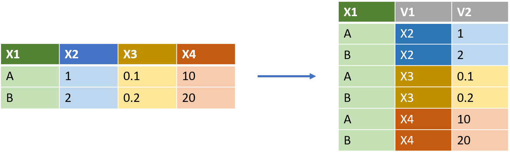
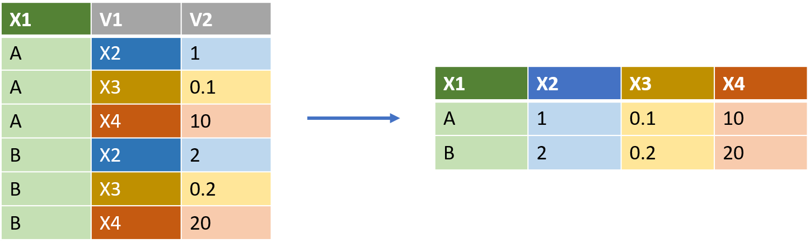
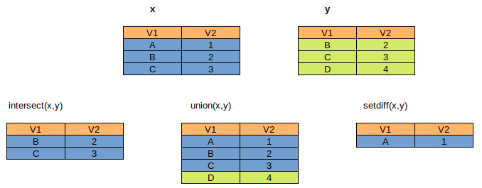

```{r include=FALSE}
library(fontawesome)
``` 

&ensp;`r fa(name = "fas fa-house", fill = "grey", height = "1em")` &ensp;https://can.gitbiopages.ens-lyon.fr/R_basis/


```{r setup, include=FALSE}
rm(list=ls())
knitr::opts_chunk$set(echo = TRUE)
knitr::opts_chunk$set(comment = NA)
```
```{r klippy, echo=FALSE, include=TRUE}
klippy::klippy(
  position = c('top', 'right'),
  color = "white",
  tooltip_message = 'Click to copy',
  tooltip_success = 'Copied !')
```

# Introduction

Until now we have worked with data already formated in a *nice way*.
In the `tidyverse` data formated in a *nice way* are called **tidy**
The goal of this practical is to understand how to transform an hugly blob of information into a **tidy** data set.

## Tidydata

There are three interrelated rules which make a dataset tidy:

- Each variable must have its own column.
- Each observation must have its own row.
- Each value must have its own cell.

Doing this kind and transformation is often called **data wrangling**, due to the felling that we have to *wrangle* with the data to force them into a **tidy** format.

But once this step is finish most of the subsequent analysis will be realy fast to do !

<div class="pencadre">
As usual we will need the `tidyverse` library.
</div>

<details><summary>Solution</summary>
<p>
```{r load_data, eval=T, message=F}
library(tidyverse)
```
</p>
</details>

For this practical we are going to use the `table` set of datasets which demonstrate multiple ways to layout the same tabular data.

<div class="pencadre">
Use the help to know more about `table1` dataset
</div>

<details><summary>Solution</summary>

```{r}
?table1
```

<p>
`table1`, `table2`, `table3`, `table4a`, `table4b`, and `table5` all display the number of TB (Tuberculosis) cases documented by the World Health Organization in Afghanistan, Brazil, and China between 1999 and 2000. The data contains values associated with four variables (country, year, cases, and population), but each table organizes the values in a different layout.

The data is a subset of the data contained in the World Health Organization Global Tuberculosis Report
</p>
</details>

# Pivoting data

## pivot longer

```{r, echo=FALSE, out.width='100%'}

```

```{r, eval = F}
wide_example <- tibble(X1 = c("A","B"),
                      X2 = c(1,2),
                      X3 = c(0.1,0.2),
                      X4 = c(10,20))
```

If you have a wide dataset, such as `wide_example`, that you want to make longer, you will use the `pivot_longer()` function. 

You have to specify the names of the columns you want to pivot into longer format (X2,X3,X4):

```{r, eval = F}
wide_example %>%
  pivot_longer(c(X2,X3,X4))
```

... or the reverse selection (-X1):

```{r, eval = F}
wide_example %>% pivot_longer(-X1)
```

You can specify the names of the columns where the data will be tidy (by default, it is `names` and `value`):

```{r, eval = F}
long_example <- wide_example %>%
  pivot_longer(-X1, names_to = "V1", values_to = "V2")
```

### Exercice

<div class="pencadre">
Visualize the `table4a` dataset (you can use the `View()` function).

```{r table4a, eval=F, message=T}
View(table4a)
```

Is the data **tidy** ? How would you transform this dataset to make it **tidy** ?
</div>


<details><summary>Solution</summary>
<p>

We have information about 3 variables in the `table4a`: `country`, `year` and number of `cases`.
However, the variable information (`year`) is stored as column names.
We want to pivot the horizontal column year, vertically and make the table longer.

You can use the `pivot_longer` fonction to make your table longer and have one observation per row and one variable per column.

For this we need to :

- specify which column to select (all except `country`).
- give the name of the new variable (`year`)
- give the name of the variable stored in the cells of the columns years (`case`)

```{r pivot_longer, eval=T, message=T}
table4a %>% 
  pivot_longer(-country,
               names_to = "year",
               values_to = "case")
```
</p>
</details>

## pivot wider 

```{r, echo=FALSE, out.width='100%'}

```

If you have a long dataset, that you want to make wider, you will use the `pivot_wider()` function. 

You have to specify which column contains the name of the output column (`names_from`), and which column contains the cell values from (`values_from`).

```{r, eval = F}
long_example %>% pivot_wider(names_from = V1,
                             values_from = V2)
```


### Exercice

<div class="pencadre">
Visualize the `table2` dataset
Is the data **tidy** ? How would you transform this dataset to make it **tidy** ? (you can now make also make a guess from the name of the subsection)
</div>

<details><summary>Solution</summary>
<p>
The column `count` store two types of information: the `population` size of the country and the number of `cases` in the country.

You can use the `pivot_wider` fonction to make your table wider and have one observation per row and one variable per column.

```{r pivot_wider, eval=T, message=T}
table2 %>% 
  pivot_wider(names_from = type,
              values_from = count)
```
</p>
</details>

# Merging data

## Relational data

To avoid having a huge table and to save space, information is often splited between different tables.

In our `flights` dataset, information about the `carrier` or the `airports` (origin and dest) are saved in a separate table (`airlines`, `airports`).

```{r airlines, eval=T, echo = T}
library(nycflights13)
flights
airlines
airports
weather
flights2 <- flights %>% 
  select(year:day, hour, origin, dest, tailnum, carrier)
```

## Relational schema

The relationships between tables can be seen in a relational graph. The variables used to connect each pair of tables are called keys. A key is a variable (or set of variables) that uniquely identifies an observation.

```{r airlines_dag, echo=FALSE, out.width='100%'}
knitr::include_graphics('img/relational-nycflights.png')
```

## Joints

If you have to combine data from 2 tables in a a new table, you will use `joints`.

There are several types of joints depending of what you want to get. 

```{r joints, echo=FALSE, out.width='100%'}
knitr::include_graphics('img/join-venn.png')
```

Small concrete examples:

```{r , echo=FALSE, out.width='100%'}
knitr::include_graphics('img/overview_joins.png')
```

### `inner_joint()`

keeps observations in `x` AND `y`

```{r inner_joint, eval=T}
flights2 %>%
  inner_join(airlines)
```

### `left_joint()`

keeps all observations in `x`

```{r left_joint, eval=T}
flights2 %>%
  left_join(airlines)
```

### `right_joint()`

keeps all observations in `y`

```{r right_joint, eval=T}
flights2 %>%
  right_join(airlines)
```

### `full_joint()`

keeps all observations in `x` and `y`

```{r full_joint, eval=T}
flights2 %>%
  full_join(airlines)
```

## Defining the key columns

The default, `by = NULL`, uses all variables that appear in both tables, the so called natural join.

```{r , eval=T}
flights2 %>% 
  left_join(weather)
```

If the two tables contain columns with the same names but corresponding to different things (such as `year` in `flights2` and `planes`) you have to manually define the key or the keys.

```{r , eval=T, echo = T}
flights2 %>% 
  left_join(planes, by = "tailnum")
```

If you want to join by data that are in two columns with different names, you must specify the correspondence with a named character vector: `by = c("a" = "b")`. This will match variable `a` in table `x` to variable `b` in table `y`.

```{r , eval=T, echo = T}
flights2 %>% 
  left_join(airports, c("dest" = "faa"))
```

If 2 columns have identical names in the input tables but are not used in the join, they are automatically renamed with the suffix `.x` and `.y` because all column names must be different in the output table.

```{r , eval=T, echo = T}
flights2 %>% 
  left_join(airports, c("dest" = "faa")) %>% 
  left_join(airports, c("origin" = "faa"))
```

You can change the suffix using the option `suffix`

```{r , eval=T, echo = T}
flights2 %>% 
  left_join(airports, by = c("dest" = "faa")) %>% 
  left_join(airports, by = c("origin" = "faa"), suffix = c(".dest",".origin"))
```

## Filtering joins

Filtering joins match observations in the same way as mutating joins, but affect the observations, not the variables. There are two types:

- `semi_join(x, y)` keeps all observations in `x` that have a match in `y`.
- `anti_join(x, y)` drops all observations in `x` that have a match in `y`.

```{r top_dest, eval=T, echo = T}
top_dest <- flights %>%
  count(dest, sort = TRUE) %>%
  head(10)
flights %>% 
  semi_join(top_dest)
```

## Set operations

These expect the x and y inputs to have the same variables, and treat the observations like sets:

- `intersect(x, y)`: return only observations in both `x` and `y`.
- `union(x, y)`: return unique observations in `x` and `y`.
- `setdiff(x, y)`: return observations in `x`, but not in `y`.

```{r , echo=FALSE, out.width='100%'}

```

## See you in [R.7: String & RegExp](https://can.gitbiopages.ens-lyon.fr/R_basis/session_7/)
